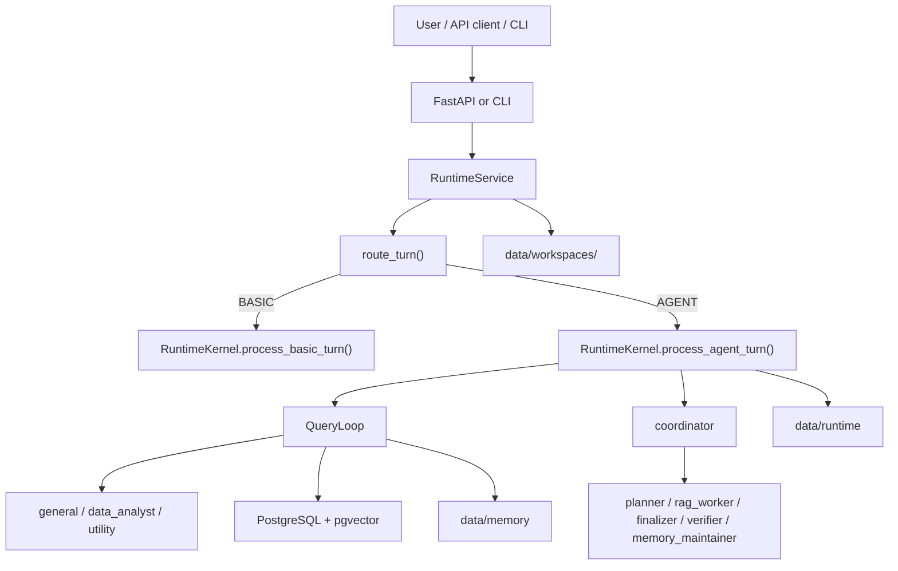

# Agentic RAG Chatbot v2

Agentic document-intelligence runtime built on LangChain, tactical LangGraph ReAct loops,
PostgreSQL + pgvector, file-backed runtime persistence, and a live `agentic_chatbot_next`
session kernel.

## Live runtime

The live API and CLI now execute through `src/agentic_chatbot_next/`.

Current top-level turn flow:

- transport and bootstrapping: `src/agentic_chatbot/api/main.py`, `src/agentic_chatbot/cli.py`
- live runtime service: `src/agentic_chatbot_next/app/service.py`
- route selection: `src/agentic_chatbot_next/router/`
- session kernel: `src/agentic_chatbot_next/runtime/kernel.py`
- executor loop: `src/agentic_chatbot_next/runtime/query_loop.py`
- late-bound agents from markdown frontmatter: `data/agents/*.md`

`src/agentic_chatbot/agents/orchestrator.py` is now a deprecated compatibility shim over
`agentic_chatbot_next.app.service.RuntimeService`. The old
`src/agentic_chatbot/runtime/*` package is reference-only.

## Runtime model

Every turn is routed to one of two paths:

- `BASIC`: direct chat, no tools
- `AGENT`: late-bound agent execution with tools, worker jobs, notifications, and persistence

Active agent roles:

- `basic`
- `general`
- `coordinator`
- `utility`
- `data_analyst`
- `rag_worker`
- `planner`
- `finalizer`
- `verifier`
- `memory_maintainer`

Runtime persistence layout:

- `data/runtime/sessions/<filesystem_key(session_id)>/`
- `data/runtime/jobs/<filesystem_key(job_id)>/`
- `data/workspaces/<filesystem_key(session_id)>/`
- `data/memory/tenants/<tenant>/users/<user>/...`

Memory in the live next runtime is file-backed. The old PostgreSQL memory table is not part of
the live memory path anymore.

## Architecture



## Quick start

`.env.example` is geared toward a local/dev setup. For Azure, NVIDIA, or mixed-provider
configurations, see `docs/PROVIDERS.md`.

### Option 1: Host Python app, Docker PostgreSQL, Ollama on host

Prerequisites:

- Python 3.12+
- Docker
- Ollama installed locally

```bash
docker compose up -d rag-postgres
ollama pull qwen3:8b
ollama pull nomic-embed-text

python -m pip install -r requirements.txt
cp .env.example .env

python run.py doctor
python run.py migrate
python run.py index-skills
python run.py sync-kb
python run.py chat
```

### Option 2: Full Docker Compose stack

```bash
cp .env.example .env
docker compose --profile ollama up -d --build
docker compose exec ollama ollama pull qwen3:8b
docker compose exec ollama ollama pull nomic-embed-text

docker compose exec app python run.py doctor
docker compose exec app python run.py index-skills
docker compose exec app python run.py sync-kb
docker compose exec app python run.py ask -q "Summarize the indexed MSA."
```

## Start testing

### CLI

```bash
python run.py ask -q "Hello there"
python run.py ask -q "Compare the services agreement and cite the differences." --force-agent
python run.py chat
```

Useful commands:

- `python run.py serve-api`
- `python run.py sync-kb`
- `python run.py reindex-document <path>`
- `python run.py delete-document <doc_id>`
- `python run.py index-skills`
- `python run.py list-skills`
- `python run.py inspect-skill <skill_id>`
- `python run.py demo --list-scenarios`

### API

Start the gateway:

```bash
python run.py serve-api --host 0.0.0.0 --port 8000
```

Smoke tests:

```bash
curl http://127.0.0.1:8000/health/ready
curl http://127.0.0.1:8000/v1/models
```

```bash
curl -X POST http://127.0.0.1:8000/v1/chat/completions \
  -H "Content-Type: application/json" \
  -H "X-Conversation-ID: readme-demo" \
  -d '{
    "model": "enterprise-agent",
    "messages": [
      {"role": "user", "content": "Summarize the indexed MSA and cite the answer."}
    ],
    "metadata": {"force_agent": true}
  }'
```

```bash
curl -X POST http://127.0.0.1:8000/v1/ingest/documents \
  -H "Content-Type: application/json" \
  -H "X-Conversation-ID: readme-demo" \
  -d '{
    "paths": ["./new_demo_notebook/demo_data/regional_spend.csv"],
    "source_type": "upload"
  }'
```

### Demo paths

CLI scenarios:

```bash
python run.py demo --list-scenarios
python run.py demo --scenario <name> --verify
```

Notebook showcase:

```bash
python -m pip install -r new_demo_notebook/requirements.txt
jupyter notebook new_demo_notebook/agentic_system_showcase.ipynb
```

The notebook starts the live API server, calls `/v1/chat/completions` and
`/v1/ingest/documents`, then renders traces from `data/runtime`. It now fails
the run immediately when any scenario misses its expected orchestration behavior.

Manual acceptance target:

```bash
RUN_NEXT_RUNTIME_ACCEPTANCE=1 pytest -m acceptance tests/test_next_acceptance_harness.py
```

Notebook execution smoke:

```bash
RUN_NEXT_RUNTIME_NOTEBOOK_ACCEPTANCE=1 pytest -m acceptance tests/test_next_acceptance_harness.py -k notebook
```

### Verified Ollama acceptance profile

Use this exact shell profile for the long-timeout local acceptance gate:

```bash
export PYTHONPATH=src
export LLM_PROVIDER=ollama
export EMBEDDINGS_PROVIDER=ollama
export JUDGE_PROVIDER=ollama
export OLLAMA_BASE_URL=http://localhost:11434
export OLLAMA_CHAT_MODEL=qwen3.5:9b
export OLLAMA_JUDGE_MODEL=qwen3.5:9b
export OLLAMA_EMBED_MODEL=nomic-embed-text:latest
export EMBEDDING_DIM=768
export DEFAULT_COLLECTION_ID=default
export SANDBOX_DOCKER_IMAGE=agentic-chatbot-sandbox:py312

export NEXT_RUNTIME_GATEWAY_TIMEOUT_SECONDS=900
export NEXT_RUNTIME_JOB_WAIT_SECONDS=300
export NEXT_RUNTIME_SERVER_READY_TIMEOUT_SECONDS=300
export NEXT_RUNTIME_NOTEBOOK_EXECUTION_TIMEOUT_SECONDS=5400
export SANDBOX_TIMEOUT_SECONDS=300
```

Run the live gate in this order:

```bash
python -m pip install -r new_demo_notebook/requirements.txt
ollama list
docker info
python run.py doctor --strict
python run.py migrate
python run.py sync-kb --collection-id default
python run.py index-skills
RUN_NEXT_RUNTIME_ACCEPTANCE=1 pytest -m acceptance tests/test_next_acceptance_harness.py
RUN_NEXT_RUNTIME_NOTEBOOK_ACCEPTANCE=1 pytest -m acceptance tests/test_next_acceptance_harness.py -k notebook
```

The notebook smoke executes `new_demo_notebook/agentic_system_showcase.ipynb` through
`nbconvert`, starts the live FastAPI server from this repository, and talks to the same
`/v1/chat/completions` and `/v1/ingest/documents` routes used by the manual API flow.

Acceptance evidence is preserved in:

- `new_demo_notebook/.artifacts/server.log`
- `new_demo_notebook/.artifacts/executed/agentic_system_showcase.executed.ipynb`
- `data/runtime/sessions/<filesystem_key(session_id)>/`
- `data/runtime/jobs/<filesystem_key(job_id)>/`
- `data/workspaces/<filesystem_key(session_id)>/`
- `data/memory/tenants/<tenant>/users/<user>/...`

Release criteria for the rearchitected runtime:

- helper and unit suites green
- live scenario-manifest acceptance green
- live notebook-execution smoke green

## In-process Python API

Prefer `RuntimeService` directly:

```python
from agentic_chatbot.config import load_settings
from agentic_chatbot.providers import build_providers
from agentic_chatbot_next.app.service import RuntimeService

settings = load_settings()
providers = build_providers(settings)
service = RuntimeService.create(settings, providers)
session = RuntimeService.create_local_session(settings, conversation_id="local-dev-chat")

answer = service.process_turn(session, user_text="Compare the MSA versions.")
```

Runnable example: `examples/python/inprocess_runtime.py`

## Important settings

```env
DEFAULT_COLLECTION_ID=default
SKILL_PACKS_DIR=./data/skill_packs
SEED_DEMO_KB_ON_STARTUP=false
SKILL_SEARCH_TOP_K=4
SKILL_CONTEXT_MAX_CHARS=4000
LLM_ROUTER_ENABLED=true
ENABLE_COORDINATOR_MODE=false
RUNTIME_EVENTS_ENABLED=true
WORKSPACE_DIR=./data/workspaces
MEMORY_DIR=./data/memory
```

`AGENT_RUNTIME_MODE` and `AGENT_DEFINITIONS_JSON` are deprecated compatibility
inputs. The live runtime ignores them.

## Troubleshooting

- run `python run.py doctor` first when provider or database setup looks wrong
- inspect `data/runtime/sessions/<fs_session_id>/events.jsonl` for routing and worker traces
- inspect `data/runtime/jobs/<fs_job_id>/` for worker outputs and mailbox state
- inspect `data/workspaces/<fs_session_id>/` when debugging data-analyst file access
- inspect `data/memory/...` when debugging file-backed memory behavior

## Relevant docs

- `docs/ARCHITECTURE.md`
- `docs/C4_ARCHITECTURE.md`
- `docs/CONTROL_FLOW.md`
- `docs/OPENAI_GATEWAY.md`
- `docs/PROVIDERS.md`
- `docs/SKILLS_PLAYBOOK.md`
- `docs/TOOLS_AND_TOOL_CALLING.md`
- `docs/OBSERVABILITY_LANGFUSE.md`
- `docs/RAG_AGENT_DESIGN.md`
- `docs/RAG_TOOL_CONTRACT.md`
- `docs/NEXT_RUNTIME_FOUNDATION.md`
