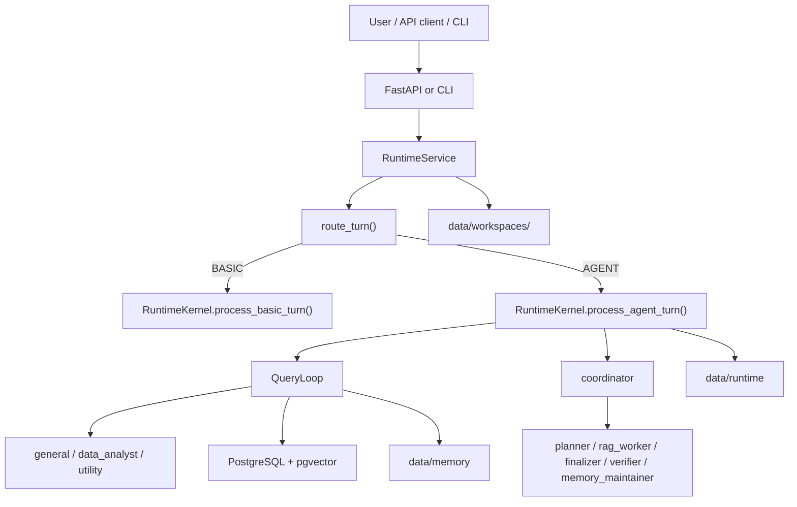

# Agentic RAG Chatbot v2

Agentic document-intelligence runtime built on LangChain, tactical LangGraph ReAct loops,
PostgreSQL + pgvector, file-backed runtime persistence, and a live `agentic_chatbot_next`
session kernel.

## Live runtime

The live API and CLI now execute through `src/agentic_chatbot_next/`.

Migration note:

- in-process callers should no longer import `agentic_chatbot.runtime.*` or
  `agentic_chatbot.agents.orchestrator.ChatbotApp`
- `agentic_chatbot_next.app.service.RuntimeService` is the supported runtime-facing surface

Current top-level turn flow:

- transport and bootstrapping: `src/agentic_chatbot_next/api/main.py`, `src/agentic_chatbot_next/cli.py`
- live runtime service: `src/agentic_chatbot_next/app/service.py`
- route selection: `src/agentic_chatbot_next/router/`
- session kernel: `src/agentic_chatbot_next/runtime/kernel.py`
- mode dispatch and shared prompt/memory/skill injection: `src/agentic_chatbot_next/runtime/query_loop.py`
- react executor and plan-execute fallback: `src/agentic_chatbot_next/general_agent.py`
- late-bound agents from markdown frontmatter: `data/agents/*.md`

## Runtime model

Every turn is routed to one of two paths:

- `BASIC`: direct chat, no tools
- `AGENT`: late-bound agent execution with tools, worker jobs, notifications, and persistence

Active agent roles:

- `basic`
- `general`
- `coordinator`
- `utility`
- `data_analyst`
- `rag_worker`
- `planner`
- `finalizer`
- `verifier`
- `memory_maintainer`

Runtime persistence layout:

- `data/runtime/sessions/<filesystem_key(session_id)>/`
- `data/runtime/jobs/<filesystem_key(job_id)>/`
- `data/workspaces/<filesystem_key(session_id)>/`
- `data/memory/tenants/<tenant>/users/<user>/...`

Memory in the live next runtime is file-backed. The old PostgreSQL memory table is not part of
the live memory path anymore.

## Runbooks

- local stack: `docs/LOCAL_DOCKER_STACK.md`
- test prompts: `docs/TEST_QUERIES.md`
- agent-harness audit: `docs/AGENT_HARNESS_AUDIT.md`

## Architecture



## Quick start

`.env.example` is geared toward a local/dev setup. For Azure, NVIDIA, or mixed-provider
configurations, see `docs/PROVIDERS.md`.

The OpenAI-compatible API still uses `GATEWAY_MODEL_ID=enterprise-agent` as its public model
ID. Per-agent runtime chat/judge overrides are configured separately through
`AGENT_<AGENT_NAME>_CHAT_MODEL` and `AGENT_<AGENT_NAME>_JUDGE_MODEL`.

### Primary local dev path

Use `docs/LOCAL_DOCKER_STACK.md` as the canonical runbook for:

- clean reset
- dependency startup
- backend startup
- frontend startup
- smoke prompts

In short:

```bash
cp .env.example .env
docker compose up -d rag-postgres
docker compose --profile ollama up -d ollama
docker compose exec ollama ollama pull gpt-oss:20b
docker compose exec ollama ollama pull nomic-embed-text:latest

python -m pip install -r requirements.txt
python run.py doctor --strict
python run.py serve-api --host 0.0.0.0 --port 8000
```

Then start the frontend from `frontend/` with:

```bash
npm install
npm run dev -- --host 0.0.0.0 --port 5173
```

### Secondary deployment path: Dockerized API service

This is supported, but it is not the default developer workflow for this repo.

```bash
cp .env.example .env
docker compose up -d rag-postgres
docker compose --profile ollama up -d ollama
docker compose exec ollama ollama pull gpt-oss:20b
docker compose exec ollama ollama pull nomic-embed-text:latest
docker compose up -d app
```

## Start testing

### CLI

```bash
python run.py ask -q "Hello there"
python run.py ask -q "Compare the services agreement and cite the differences." --force-agent
```

Useful commands:

- `python run.py chat`
- `python run.py serve-api --host 0.0.0.0 --port 8000`
- `python run.py sync-kb`
- `python run.py reindex-document <path>`
- `python run.py delete-document <doc_id>`
- `python run.py index-skills`
- `python run.py list-skills`
- `python run.py inspect-skill <skill_id>`
- `python run.py demo --list-scenarios`

### API

Health and model checks:

```bash
curl http://127.0.0.1:8000/health/ready
curl http://127.0.0.1:8000/v1/models
```

`/health/ready` is KB-aware. It returns `503` with `reason`, `missing_sources`, and a
`suggested_fix` when the configured KB/docs corpus is not indexed for the active collection.

Chat completion smoke:

```bash
curl -X POST http://127.0.0.1:8000/v1/chat/completions \
  -H "Content-Type: application/json" \
  -H "X-Conversation-ID: readme-demo" \
  -d '{
    "model": "enterprise-agent",
    "messages": [
      {"role": "user", "content": "Summarize the indexed MSA and cite the answer."}
    ],
    "metadata": {"force_agent": true}
  }'
```

Path-based ingest with proactive workspace preparation:

```bash
curl -X POST http://127.0.0.1:8000/v1/ingest/documents \
  -H "Content-Type: application/json" \
  -H "X-Conversation-ID: readme-demo" \
  -d '{
    "paths": ["./new_demo_notebook/demo_data/regional_spend.csv"],
    "source_type": "upload"
  }'
```

Multipart upload endpoint used by the frontend:

```bash
curl -X POST http://127.0.0.1:8000/v1/upload \
  -H "X-Conversation-ID: readme-demo" \
  -F "files=@new_demo_notebook/demo_data/regional_spend.csv"
```

`/v1/ingest/documents` is the guaranteed pre-chat workspace-seeding path. `/v1/upload`
is the frontend multipart upload endpoint; it ingests files into the KB, but workspace
copy behavior is currently best-effort rather than the canonical seeding path.

### Demo and acceptance

- optional notebook showcase and acceptance harness: `new_demo_notebook/README.md`
- local smoke prompts: `docs/TEST_QUERIES.md`
- local operator runbook: `docs/LOCAL_DOCKER_STACK.md`

`new_demo_notebook/` is supported as acceptance and demo infrastructure for the live
next-runtime system. It is not part of the core runtime package surface.

## In-process Python API

Prefer `RuntimeService` directly:

```python
from agentic_chatbot_next.config import load_settings
from agentic_chatbot_next.providers import build_providers
from agentic_chatbot_next.app.service import RuntimeService

settings = load_settings()
providers = build_providers(settings)
service = RuntimeService.create(settings, providers)
session = RuntimeService.create_local_session(settings, conversation_id="local-dev-chat")

answer = service.process_turn(session, user_text="Compare the MSA versions.")
```

Runnable example: `examples/python/inprocess_runtime.py`

## Important settings

```env
DEFAULT_COLLECTION_ID=default
GATEWAY_MODEL_ID=enterprise-agent
SKILL_PACKS_DIR=./data/skill_packs
SEED_DEMO_KB_ON_STARTUP=true
SKILL_SEARCH_TOP_K=4
SKILL_CONTEXT_MAX_CHARS=4000
LLM_ROUTER_ENABLED=true
ENABLE_COORDINATOR_MODE=false
RUNTIME_EVENTS_ENABLED=true
WORKSPACE_DIR=./data/workspaces
RUNTIME_DIR=./data/runtime
AGENT_GENERAL_CHAT_MODEL=gpt-oss:20b
AGENT_GENERAL_JUDGE_MODEL=gpt-oss:20b
```

`AGENT_RUNTIME_MODE` and `AGENT_DEFINITIONS_JSON` are deprecated compatibility
inputs. The live runtime ignores them.

## Troubleshooting

- run `python run.py doctor --strict` first when provider or database setup looks wrong
- use `docs/LOCAL_DOCKER_STACK.md` for clean reset and restart steps
- inspect `data/runtime/sessions/<fs_session_id>/events.jsonl` for routing and worker traces
- inspect `data/runtime/jobs/<fs_job_id>/` for worker outputs and mailbox state
- inspect `data/workspaces/<fs_session_id>/` when debugging data-analyst file access
- inspect `data/memory/...` when debugging file-backed memory behavior

## Relevant docs

- `docs/ARCHITECTURE.md`
- `docs/C4_ARCHITECTURE.md`
- `docs/CONTROL_FLOW.md`
- `docs/OPENAI_GATEWAY.md`
- `docs/PROVIDERS.md`
- `docs/SKILLS_PLAYBOOK.md`
- `docs/TOOLS_AND_TOOL_CALLING.md`
- `docs/OBSERVABILITY_LANGFUSE.md`
- `docs/RAG_AGENT_DESIGN.md`
- `docs/RAG_TOOL_CONTRACT.md`
- `docs/NEXT_RUNTIME_FOUNDATION.md`
- `new_demo_notebook/README.md`
