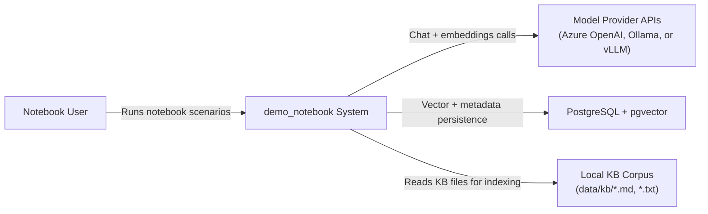
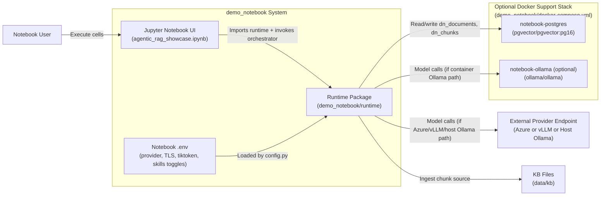
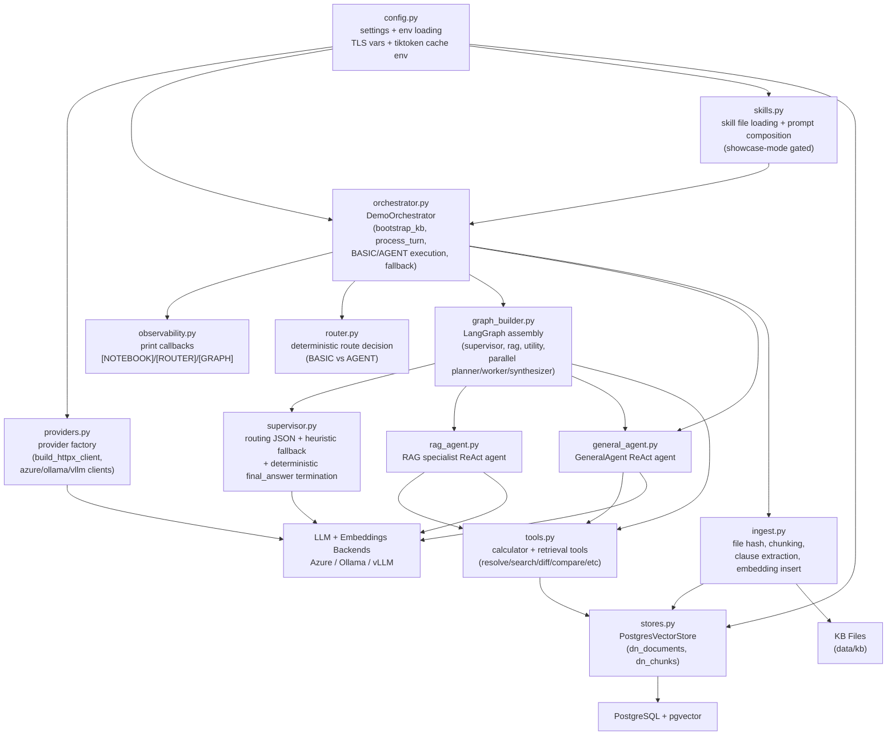
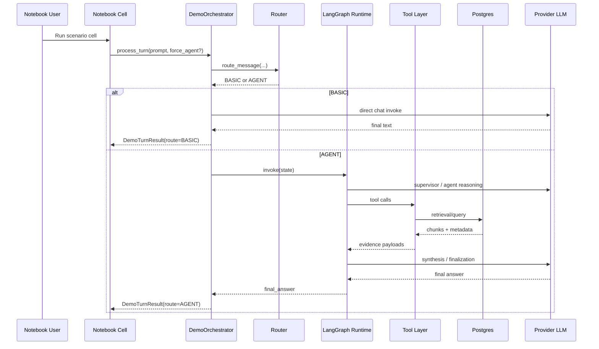

# C4 Architecture (Standalone demo_notebook)

This C4 set describes only the isolated notebook deliverable under `demo_notebook/`.

## C4 Level 1: System Context

## C4 Level 2: Container View

## C4 Level 3: Component View (Runtime Package)

## Runtime Execution Diagram (BASIC vs AGENT)

## Notes

1. Skills are optional and only applied when `NOTEBOOK_SKILLS_ENABLED=true` and `NOTEBOOK_SKILLS_SHOWCASE_MODE=true`.
2. TLS and corporate cert behavior is configured in `.env` and applied through `config.py` + provider HTTP client wiring.
3. The notebook store is isolated from the main app schema (`dn_documents`, `dn_chunks`).
