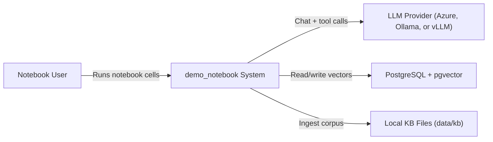
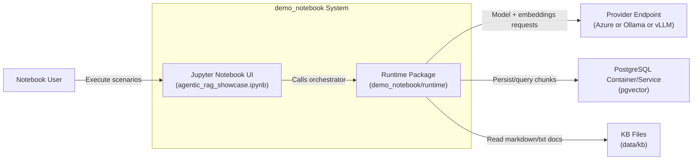
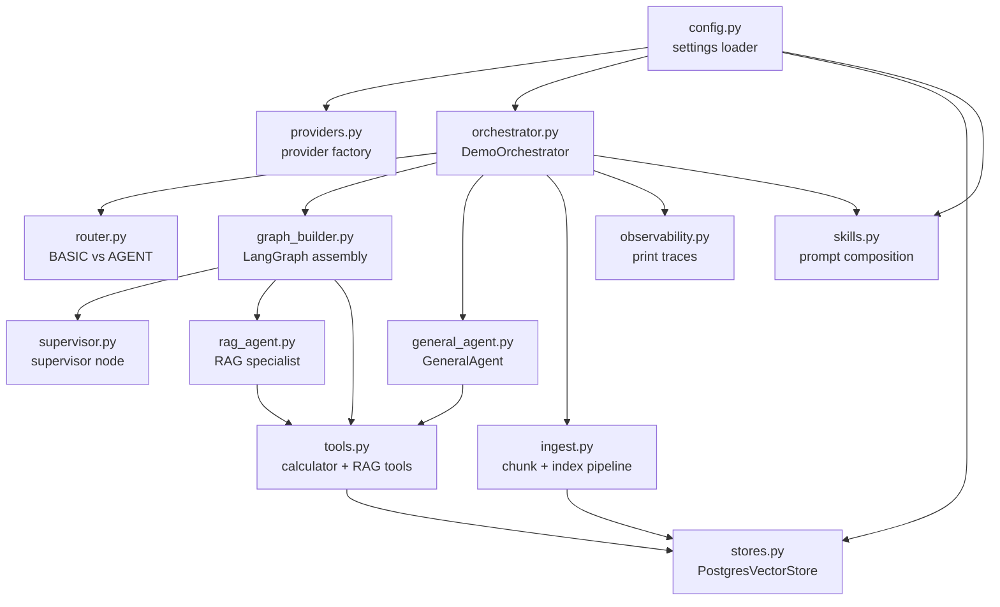

# C4 Architecture (Standalone demo_notebook)

This C4 set describes only the isolated notebook deliverable under `demo_notebook/`.

## C4 Level 1: System Context

## C4 Level 2: Container View

## C4 Level 3: Component View (Runtime Package)

## Data Flow by Scenario

1. BASIC route
- Notebook calls `DemoOrchestrator.process_turn(...)`.
- `router.py` selects `BASIC`.
- Direct chat response from provider; no graph execution.

2. AGENT RAG route
- Router selects `AGENT`.
- Graph enters supervisor and routes to `rag_agent`.
- RAG tools perform retrieval from `dn_chunks`; response includes citations.

3. Parallel route
- Supervisor selects `parallel_rag`.
- Planner fans out to multiple RAG workers.
- Synthesizer merges worker outputs into one answer.

4. GeneralAgent direct route
- Notebook calls `run_general_agent_direct(...)`.
- GeneralAgent may invoke calculator/list-doc/rag-agent-tool chain.

## Skills note

`skills.py` is only applied when showcase mode is enabled. Baseline demos keep default prompt behavior.
