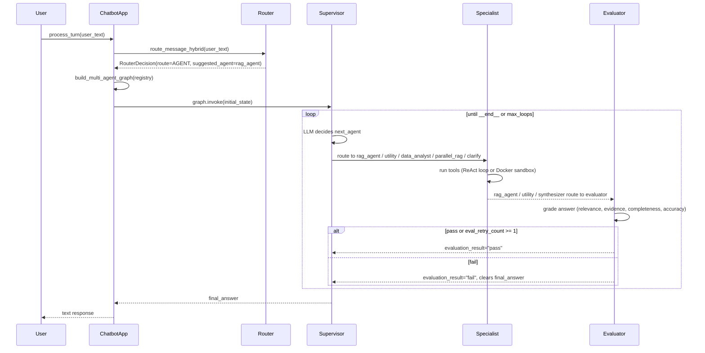

# Agent Deep Dive

Technical reference for every agent in the agentic RAG chatbot. Covers class structures, method signatures, execution flow, state management, and internal decision logic.

---

## Table of Contents

1. [System Entry Point — `ChatbotApp`](#1-system-entry-point--chatbotapp)
2. [Router Layer](#2-router-layer)
3. [Supervisor Agent](#3-supervisor-agent)
4. [Agent Registry](#4-agent-registry)
5. [RAG Agent](#5-rag-agent)
6. [RAG Graph Node Adapter](#6-rag-graph-node-adapter)
7. [Utility Agent](#7-utility-agent)
8. [Data Analyst Agent](#8-data-analyst-agent)
9. [Docker Sandbox Executor](#9-docker-sandbox-executor)
10. [Parallel RAG — Planner / Worker / Synthesizer](#10-parallel-rag--planner--worker--synthesizer)
11. [Skills System](#11-skills-system)
12. [General Agent Fallback](#12-general-agent-fallback)
13. [State Schema — `AgentState`](#13-state-schema--agentstate)
14. [Session and Proxy Objects](#14-session-and-proxy-objects)
15. [Evaluator Node](#15-evaluator-node)
16. [Clarification Node](#16-clarification-node)
17. [GraphRAG Integration](#17-graphrag-integration)
18. [Ingestion Pipeline — Contextual Retrieval](#18-ingestion-pipeline--contextual-retrieval)

---

## 1. System Entry Point — `ChatbotApp`

**Module:** `src/agentic_chatbot/agents/orchestrator.py`

### Class Hierarchy

```
AppContext (dataclass)
  ├── settings: Settings
  ├── providers: ProviderBundle (chat LLM, judge LLM, embeddings)
  └── stores: KnowledgeStores (ChunkStore, DocumentStore, MemoryStore)

ChatbotApp
  ├── ctx: AppContext
  ├── _general_agent_system_prompt: str   ← loaded once at __init__
  └── _basic_chat_system_prompt: str      ← loaded once at __init__
```

### Instantiation

```python
ChatbotApp.create(settings, providers)
  → load_stores(settings, providers.embeddings)
  → AppContext(settings, providers, stores)
  → ChatbotApp(ctx)
  → ensure_kb_indexed(...)   # index KB documents at startup
  → load_general_agent_skills(settings)   # read skills/general_agent.md once
  → load_basic_chat_skills(settings)      # read skills/basic_chat.md once
```

Skill files are loaded **once at startup** for `general_agent` and `basic_chat`. Per-turn loading is used for `rag_agent`, `supervisor`, `utility_agent`, and `data_analyst_agent` (see [Skills System](#11-skills-system)).

### `process_turn()` — Turn Lifecycle

```
process_turn(session, user_text, upload_paths=None, force_agent=False)
  │
  ├── 1. Upload ingestion (if upload_paths present)
  │       ingest_and_summarize_uploads(session, upload_paths)
  │         → ingest_paths(...)           # chunk + embed + store in PostgreSQL
  │         → _call_rag_direct(...)       # kick off upload summary RAG
  │         → session.messages.append(AIMessage(summary))
  │
  ├── 2. Routing decision
  │       if settings.llm_router_enabled:
  │           route_message_hybrid(user_text, has_attachments, judge_llm, ...)
  │       else:
  │           route_message(user_text, has_attachments, ...)
  │       → RouterDecision(route, confidence, reasons, suggested_agent)
  │
  ├── 3a. BASIC branch
  │       run_basic_chat(providers.chat, messages, user_text, system_prompt)
  │       → session.messages.append(AIMessage)
  │       → clear scratchpad if configured
  │       → return text
  │
  └── 3b. AGENT branch
          _run_multi_agent_graph(session, user_text, callbacks, suggested_agent)
          │
          ├── builds AgentRegistry(settings)
          ├── builds graph via build_multi_agent_graph(...)
          ├── builds initial_state via build_initial_state(session, user_text, suggested_agent)
          ├── graph.invoke(initial_state, config={callbacks, recursion_limit=50})
          ├── syncs session.messages ← result["messages"]
          ├── syncs session.scratchpad ← result["scratchpad"]
          └── extracts final answer from result["final_answer"] or last AIMessage

          on _is_graph_capability_error(exc):
              _run_general_agent_fallback(session, user_text, callbacks)
```

### Error Handling in `_run_multi_agent_graph`

`_is_graph_capability_error(exc)` returns `True` when the exception message contains:
- `"bind_tools"`, `"tool calling"`, `"tool-calling"`, `"does not support tool"`, `"not implemented"`, `"unsupported"`
- Or the exception is `NotImplementedError`, `ModuleNotFoundError`, `ImportError`

When triggered, the fallback path runs `GeneralAgent` with a `rag_agent_tool` wrapper. Any other exception propagates and returns an explicit error message to the user (no silent fallback).

---

## 2. Router Layer

### Deterministic Router

**Module:** `src/agentic_chatbot/router/router.py`

```python
@dataclass
class RouterDecision:
    route: str              # "BASIC" | "AGENT"
    confidence: float       # 0.0–1.0
    reasons: List[str]      # human-readable escalation reasons
    suggested_agent: str    # "" | "rag_agent" | "utility_agent" | "parallel_rag" | "data_analyst"
    router_method: str      # "deterministic" | "llm" | "llm_fallback"
```

**Escalation to AGENT triggers (checked in order):**

| Trigger | Confidence | Suggested Agent |
|---|---|---|
| `has_attachments=True` | 0.90 | `""` |
| `explicit_force_agent=True` | 0.90 | `""` |
| Data analysis pattern match (`_DATA_ANALYSIS_PATTERNS`) | 0.85 | `"data_analyst"` |
| Tool-verb pattern match (`_TOOL_VERB_PATTERNS`) | 0.80 | `""` |
| Citation request (`_CITATION_PATTERNS`) | 0.80 | `"rag_agent"` |
| High-stakes keywords (`_HIGH_STAKES_PATTERNS`) | 0.75 | `"rag_agent"` |
| Long input (> 200 chars) | 0.70 | `""` |

BASIC path is returned with confidence 0.85 when none of the above triggers fire.

### Hybrid LLM Router

**Module:** `src/agentic_chatbot/router/llm_router.py`

```
route_message_hybrid(user_text, has_attachments, judge_llm, history_summary,
                     explicit_force_agent, llm_confidence_threshold=0.70)
  │
  ├── Step 1: run deterministic router → RouterDecision
  │
  ├── Bypass LLM if:
  │     has_attachments → return deterministic (router_method="deterministic")
  │     explicit_force_agent → return deterministic (router_method="deterministic")
  │     deterministic.confidence >= llm_confidence_threshold → return deterministic
  │
  └── Step 2: consult LLM
        _call_llm_router(user_text, history_summary, judge_llm)
          │
          ├── try: judge_llm.with_structured_output(LLMRouterOutput).invoke(messages)
          └── except: judge_llm.invoke(messages) → _parse_llm_response_text()

        merge deterministic + LLM result → return RouterDecision(router_method="llm")
        on any LLM error → return deterministic (router_method="llm_fallback")
```

**`LLMRouterOutput` schema (Pydantic):**
```python
class LLMRouterOutput(BaseModel):
    route: str                # "BASIC" | "AGENT"
    confidence: float         # 0.0–1.0
    reasoning: str
    suggested_agent: str      # "" | "rag_agent" | "utility_agent" | "parallel_rag" | "data_analyst"
```

The LLM router is consulted only when the deterministic confidence is below threshold — avoiding LLM latency for clear-cut cases like greetings (BASIC) or file uploads (AGENT).

---

## 3. Supervisor Agent

**Module:** `src/agentic_chatbot/graph/supervisor.py`

The supervisor is a stateful LLM node that implements the routing loop at the heart of the multi-agent graph.

### Factory Function

```python
make_supervisor_node(
    chat_llm,
    settings,
    callbacks=None,
    max_loops=5,
    registry=None,        # AgentRegistry | None
) -> Callable[[AgentState], Dict[str, Any]]
```

The factory **closes over** `system_prompt`, `valid_agents`, and a mutable `loop_count` integer. Every call to the returned `supervisor_node` function shares this closure state.

### `supervisor_node(state)` — Execution Flow

```
supervisor_node(state)
  │
  ├── 1. Demo-mode early exit
  │       If state["demo_mode"] is True and an AIMessage exists after the
  │       last HumanMessage → return immediately with that message as
  │       final_answer. Prevents extra supervisor loops in showcase scenarios.
  │
  ├── 2. Safety loop guard
  │       loop_count += 1
  │       if loop_count > max_loops:
  │           force next_agent = "__end__"
  │           return last AIMessage content as final_answer
  │
  ├── 3. Build supervisor messages
  │       [SystemMessage(system_prompt)]
  │       + state["messages"]  (full conversation history)
  │       + optional SystemMessage with formatted rag_results
  │
  ├── 4. Invoke LLM
  │       chat_llm.invoke(supervisor_msgs, config={callbacks, tags=["supervisor"]})
  │
  ├── 5. Parse response
  │       _parse_supervisor_response(content, valid_agents=valid_agents)
  │
  └── 6. Build state update dict
          {"next_agent": "rag_agent" | "utility_agent" | ... | "__end__"}
          + if __end__: {"final_answer": ..., "messages": [AIMessage(...)]}
          + if parallel_rag: {"rag_sub_tasks": [...], "next_agent": "parallel_rag"}
            (validates sub-tasks exist; falls back to rag_agent if none)
```

### `_parse_supervisor_response(content, valid_agents)` — JSON Extraction Pipeline

The supervisor LLM is expected to return JSON like:
```json
{"next_agent": "rag_agent", "reasoning": "User asked about contracts"}
```

The parser tries three strategies in order:

1. **Full JSON parse** — `json.loads(text.strip())`
2. **Markdown code block** — extract between ` ```json ` and ` ``` `
3. **Heuristic keyword fallback** — scan lowercased text for:
   - `parallel`, `compare` → `parallel_rag`
   - `document`, `clause`, `citation` → `rag_agent`
   - `calcul`, `memory`, `list document` → `utility_agent`
   - `data`, `excel`, `csv`, `spreadsheet` → `data_analyst`
   - Default → `__end__` with `direct_answer = text`

Unknown `next_agent` values are corrected to `"rag_agent"` with a warning log.

### Prompt — Dynamic Agent Injection

`_build_supervisor_prompt()` calls `load_supervisor_skills(settings, context={"available_agents": registry.format_for_supervisor_prompt()})`.

The `{{available_agents}}` template variable is replaced with a markdown block listing all enabled agents at graph build time (see [Agent Registry](#4-agent-registry)).

---

## 4. Agent Registry

**Module:** `src/agentic_chatbot/agents/agent_registry.py`

### `AgentSpec` Frozen Dataclass

```python
@dataclass(frozen=True)
class AgentSpec:
    name: str           # graph node name used in routing, e.g. "data_analyst"
    display_name: str   # human label, e.g. "Data Analyst Agent"
    description: str    # 2-3 sentence capability summary for supervisor prompt
    use_when: List[str] # bullet conditions for supervisor routing guidance
    skills_key: str     # key passed to SkillsLoader, e.g. "data_analyst_agent"
    enabled: bool       # False → hidden from supervisor and graph wiring
```

`frozen=True` means `AgentSpec` instances are immutable and hashable.

### `AgentRegistry`

```python
class AgentRegistry:
    def __init__(self, settings): ...
    def register(spec: AgentSpec) -> None
    def get(name: str) -> AgentSpec | None
    def list_enabled() -> List[AgentSpec]
    def valid_agent_names() -> set   # enabled names + {"__end__"}
    def format_for_supervisor_prompt() -> str
```

**Instantiation flow:**

```
AgentRegistry(settings)
  → _register_builtin_agents()
      → register(rag_agent_spec)
      → register(utility_agent_spec)
      → register(parallel_rag_spec)
      → _check_docker_available()
          import docker; docker.from_env().ping() → True/False
      → register(data_analyst_spec, enabled=docker_ok)
      if not docker_ok: logger.warning(...)
```

`_check_docker_available()` calls `docker.from_env().ping()` non-blocking. Any exception returns `False`. This runs once per turn (when `ChatbotApp._run_multi_agent_graph()` instantiates `AgentRegistry`).

**`format_for_supervisor_prompt()` output example:**
```markdown
## Available Agents

### 1. `rag_agent`
Searches, extracts, and reasons over documents...

Use when:
- User asks about content in uploaded documents
- Questions needing citations or grounded answers
...
```

This rendered block is injected into `supervisor_agent.md` at the `{{available_agents}}` template position every time the supervisor node is built.

---

## 5. RAG Agent

**Module:** `src/agentic_chatbot/rag/agent.py`

The RAG agent is a free function (not a class) that implements the full Retrieval-Augmented Generation loop using `create_react_agent`.

### `run_rag_agent()` Signature

```python
def run_rag_agent(
    settings: Settings,
    stores: KnowledgeStores,
    *,
    llm: Any,
    judge_llm: Any,
    query: str,
    conversation_context: str,
    preferred_doc_ids: List[str] = (),
    must_include_uploads: bool = False,
    top_k_vector: int = 8,
    top_k_keyword: int = 4,
    max_retries: int = 2,
    session: Any,                     # ChatSession or SessionProxy
    callbacks: List[Any] = (),
) -> Dict[str, Any]                   # RAG contract dict
```

### RAG Contract Dict (Return Type)

```python
{
    "answer": str,                    # grounded answer text
    "citations": List[{               # all retrieved supporting citations
        "citation_id": str,
        "title": str,
        "location": str,
        "excerpt": str,
        "confidence": float,
    }],
    "used_citation_ids": List[str],   # subset actually referenced in answer
    "confidence": float,              # 0.0–1.0 overall confidence
    "retrieval_summary": str,         # brief description of what was found
    "warnings": List[str],            # e.g. "LOW_CONFIDENCE", "NO_RESULTS"
    "followups": List[str],           # suggested follow-up questions
}
```

This contract dict is the fixed API boundary between `run_rag_agent()` and all callers: `rag_agent_node`, `rag_worker_node`, `rag_agent_tool`, and `orchestrator._call_rag_direct()`.

### Execution Flow

```
run_rag_agent(...)
  │
  ├── 1. Load system prompt
  │       load_rag_agent_skills(settings)
  │         → SkillsLoader.load("rag_agent", context=None)
  │         → hot-reload: checks mtime of rag_agent.md each call
  │
  ├── 2. Build tools
  │       make_all_rag_tools(settings, stores, session, llm=llm, judge_llm=judge_llm)
  │         → core tools: resolve_document, search_document, search_all_documents,
  │                       full_text_search_document, extract_clauses, list_document_structure,
  │                       extract_requirements, compare_clauses, diff_documents,
  │                       search_by_metadata,
  │                       scratchpad_write (persist=True for cross-turn artifacts),
  │                       scratchpad_read (fallback to .artifacts/),
  │                       scratchpad_list
  │       if settings.rag_extended_tools_enabled:
  │           make_extended_rag_tools(...)  → 5 additional tools:
  │             query_rewriter, chunk_expander, document_summarizer,
  │             citation_validator, web_search_fallback
  │       if settings.graphrag_enabled:
  │           → add graph_search_local, graph_search_global tools
  │
  ├── 3. Tool-calling support check
  │       try: llm.bind_tools(tools) → supports_tool_calls = True
  │       except: → _run_rag_retrieval_fallback(...)
  │
  ├── 4. ReAct agent loop (tool-calling path)
  │       create_react_agent(llm, tools=all_tools)
  │       graph.invoke({"messages": [SystemMessage, HumanMessage(query)]}, config)
  │       recursion_limit = (max_retries * 2 + 1) * 2 + 1
  │
  ├── 5. Extract retrieved documents
  │       _extract_docs_from_messages(result["messages"])
  │         → scan ToolMessage contents for citation dicts
  │
  └── 6. Final synthesis call
          llm.invoke([SystemMessage(synthesis_prompt), HumanMessage(query + docs)])
          → _build_contract(synthesis_response, retrieved_docs)
          → return RAG contract dict
```

### Tool-Calling Fallback Path

When `llm.bind_tools()` raises, `_run_rag_retrieval_fallback()` is called. This uses the legacy `rag/retrieval.py` hybrid retrieval pipeline (no tools):

```
_run_rag_retrieval_fallback(...)
  → hybrid_retrieve(query, stores, top_k_vector, top_k_keyword)
      → pgvector cosine similarity search
      → pg_trgm full-text keyword search
      → deduplicate by chunk_id
  → grade_chunks(chunks, query, judge_llm)    # rag/grading.py: score 0-3
  → filter chunks with score >= 2
  → run synthesis LLM call on filtered chunks
  → _build_contract(...)
```

---

## 6. RAG Graph Node Adapter

**Module:** `src/agentic_chatbot/graph/nodes/rag_node.py`

The RAG node is a thin adapter that bridges `AgentState` to `run_rag_agent()`.

```python
make_rag_agent_node(settings, stores, chat_llm, judge_llm, callbacks)
  → rag_agent_node(state: AgentState) -> Dict[str, Any]
```

**Inside `rag_agent_node`:**

1. `_extract_latest_query(messages)` — walks messages in reverse to find last `HumanMessage.content`
2. Creates `SessionProxy` from `state["session_id"]`, `state["tenant_id"]`, `state["scratchpad"]`, `state["uploaded_doc_ids"]`
3. `_format_conversation_context(messages, max_messages=6)` — builds a short human/ai history string
4. Calls `run_rag_agent(...)` with `preferred_doc_ids = state["uploaded_doc_ids"]`
5. On exception: returns graceful error contract
6. `render_rag_contract(contract)` — renders answer + citations + warnings + followups to a string
7. Returns `{"messages": [AIMessage(rendered)], "scratchpad": session_proxy.scratchpad}`

---

## 7. Utility Agent

**Module:** `src/agentic_chatbot/graph/nodes/utility_node.py`

```python
make_utility_agent_node(chat_llm, settings, stores, session_proxy, callbacks)
  → utility_agent_node(state: AgentState) -> Dict[str, Any]
```

**Tools provided (5):**
- `calculator` — evaluates math expressions via `numexpr`
- `list_indexed_docs` — queries `DocumentStore` to list known documents
- `memory_save(key, value)` — persists to PostgreSQL `memory` table
- `memory_load(key)` — retrieves from PostgreSQL `memory` table
- `memory_list()` — lists all stored memory keys for this session

**ReAct subgraph:**

```python
utility_graph = create_react_agent(chat_llm, tools=utility_tools)
```

Built once per call to `make_utility_agent_node()`. Invoked with:
```python
{"messages": [SystemMessage(system_prompt)] + state["messages"]}
```

`recursion_limit = (max(settings.max_agent_steps, settings.max_tool_calls) + 1) * 2 + 1`

**Demo mode shortcuts:** In `demo_mode=True`, the node bypasses the ReAct loop for two patterns:
- List documents queries → calls `list_docs_tool.invoke({})` directly, renders grouped output
- Reserve calculation queries → parses percentage + amount from user text, computes inline

---

## 8. Data Analyst Agent

**Module:** `src/agentic_chatbot/graph/nodes/data_analyst_node.py`

```python
make_data_analyst_node(chat_llm, settings, stores, session_proxy, callbacks)
  → data_analyst_node(state: AgentState) -> Dict[str, Any]
```

**Tools provided (7):**

| Tool | Description |
|---|---|
| `load_dataset(doc_id)` | Looks up doc path in `DocumentStore`, reads head + shape, stores path in `session.scratchpad["dataset_{doc_id}"]` |
| `inspect_columns(doc_id, columns)` | Reads full DataFrame, returns per-column statistics (numeric: mean/std/min/max; string: top-5 values) |
| `execute_code(code, doc_ids)` | Builds files dict from scratchpad paths, runs Python in Docker sandbox, returns `{stdout, stderr, success, execution_time_seconds}` |
| `calculator` | Reused from utility tools |
| `scratchpad_write(key, value)` | Saves to `session.scratchpad` |
| `scratchpad_read(key)` | Reads from `session.scratchpad` |
| `scratchpad_list()` | Lists all scratchpad keys |

**Plan-Verify-Reflect enforcement:** The 5-step workflow (Load → Inspect → Plan → Execute → Verify → Reflect) is enforced by `data/skills/data_analyst_agent.md`, not by Python code. The skill file contains explicit instructions that the ReAct agent follows via its system prompt. There is no state machine in Python — the LLM is trusted to follow the skill instructions.

**Graph unavailability:** If `create_react_agent` raises (tool-calling not supported), `graph_available = False` and the node returns a static error message without crashing.

---

## 9. Docker Sandbox Executor

**Module:** `src/agentic_chatbot/sandbox/docker_executor.py`

```python
@dataclass
class SandboxResult:
    stdout: str
    stderr: str
    exit_code: int
    execution_time_seconds: float
    truncated: bool = False

    @property
    def success(self) -> bool:
        return self.exit_code == 0
```

### `DockerSandboxExecutor`

```python
DockerSandboxExecutor(
    image="python:3.12-slim",
    timeout_seconds=60,
    memory_limit="512m",
    network_disabled=True,
    work_dir="/workspace",
)
```

### `execute(code, files=None, packages=None) -> SandboxResult`

Complete per-call container lifecycle:

```
1. import docker; client = docker.from_env()
   → SandboxUnavailableError if DockerException raised

2. run_script = _build_run_script(code, packages)
   → bash script:
       pip install --quiet pandas openpyxl xlrd {extra_packages} 2>/dev/null
       cat << 'PYTHON_CODE' > /workspace/script.py
       {user_code}
       PYTHON_CODE
       python /workspace/script.py

3. container = client.containers.create(
       image, command=["bash", "-c", run_script],
       network_disabled=True, mem_limit="512m",
       working_dir="/workspace", detach=True, auto_remove=False
   )

4. if files: _copy_files_to_container(container, files)
   → for each (container_path, host_path):
       read bytes → build in-memory tar (tarfile + io.BytesIO)
       container.put_archive("/", tar_bytes)

5. container.start()

6. container.wait(timeout=timeout_seconds)
   → on ReadTimeout: container.kill(); return SandboxResult(stderr="timed out", exit_code=-1)

7. stdout = container.logs(stdout=True, stderr=False)
   stderr = container.logs(stdout=False, stderr=True)

8. truncate each to 50 KB; set truncated=True if cut

9. finally: container.remove(force=True)

10. return SandboxResult(stdout, stderr, exit_code, elapsed_seconds, truncated)
```

**Security properties:**
- Network disabled per container (`network_disabled=True`)
- Memory hard cap 512 MiB by default (`mem_limit="512m"`)
- Auto-removed after execution (`container.remove(force=True)` in `finally`)
- Fresh container per call — no state carries over between tool invocations
- No host filesystem access except explicitly mounted files via `put_archive`

---

## 10. Parallel RAG — Planner / Worker / Synthesizer

**Modules:** `graph/nodes/parallel_planner_node.py`, `rag_worker_node.py`, `rag_synthesizer_node.py`

### Parallel Planner Node

```python
parallel_planner_node(state: AgentState) -> Dict[str, Any]
```

Stateless function (no factory needed). Validates `state["rag_sub_tasks"]` — each task must have `query`, `preferred_doc_ids`, `worker_id`. Creates a single default task from the latest HumanMessage if the supervisor omitted sub-tasks.

**Enriched delegation specs:** Each task is enriched by `_build_delegation_spec(task, task_index, total_tasks)` with four additional fields:
- `objective` — a clear statement of what the worker must find
- `output_format` — expected format (list of facts, comparison table, etc.)
- `boundary` — which document(s) to stay within
- `search_strategy` — inferred from query keywords: `keyword` for definition/clause queries, `vector` for similarity queries, `hybrid` as default

**Vague-query detection:** If all tasks have fewer than 3 words, the planner sets `needs_clarification=True` and `fan_out_rag_workers` routes to the clarification node instead of spawning workers.

Returns `{"rag_sub_tasks": validated_and_enriched_tasks}`.

### Fan-Out via Send API

In `builder.py`, the planner node feeds into `fan_out_rag_workers`:

```python
def fan_out_rag_workers(state: AgentState) -> list:
    tasks = state["rag_sub_tasks"][:max_workers]  # cap at settings.max_parallel_rag_workers
    sends = []
    for task in tasks:
        worker_state = dict(state)
        worker_state["rag_sub_tasks"] = [task]   # single task per worker
        worker_state["rag_results"] = []         # fresh results for this worker
        sends.append(Send("rag_worker", worker_state))
    return sends
```

LangGraph executes all `Send` targets concurrently. Each worker receives an independent copy of the state.

### RAG Worker Node

```python
make_rag_worker_node(settings, stores, chat_llm, judge_llm, callbacks)
  → rag_worker_node(state) -> {"rag_results": [one_result_dict]}
```

Each worker:
1. Reads `state["rag_sub_tasks"][0]` (always a single task due to Send)
2. Creates its own `SessionProxy` with an empty scratchpad (isolation)
3. Reads enriched delegation spec fields: `objective`, `output_format`, `boundary`, `search_strategy`
4. Prepends delegation context to `conversation_context` before calling `run_rag_agent()`
5. Calls `run_rag_agent(...)` with `preferred_doc_ids` from the task
6. On error: returns a graceful error contract with `confidence=0.0`
7. Returns `{"rag_results": [{"worker_id": ..., "query": ..., "doc_scope": ..., "contract": ...}]}`

The `merge_rag_results` reducer in `AgentState` concatenates results from all workers:
```python
def merge_rag_results(current, new) -> List:
    if any(item.get("__clear__") for item in new):
        return [item for item in new if not item.get("__clear__")]
    return current + new
```

### RAG Synthesizer Node

```python
make_rag_synthesizer_node(chat_llm, settings, callbacks)
  → rag_synthesizer_node(state) -> Dict
```

- **1 worker result:** passes contract directly through `render_rag_contract()`
- **N worker results:** calls LLM with `parallel_rag_synthesis` prompt, combined all worker answers and citations, merges deduplicated citations into final output

Always emits `{"rag_results": [{"__clear__": True}]}` to reset the accumulator for potential follow-up turns.

---

## 11. Skills System

**Module:** `src/agentic_chatbot/rag/skills_loader.py`

### `SkillsLoader`

```python
SkillsLoader(settings: Settings)
```

**Initialization:** builds `_file_map` mapping agent keys to `Path` objects from `Settings`:
```python
{
    "shared":              settings.skills_path,
    "general_agent":       settings.general_agent_skills_path,
    "rag_agent":           settings.rag_agent_skills_path,
    "supervisor_agent":    settings.supervisor_agent_skills_path,
    "utility_agent":       settings.utility_agent_skills_path,
    "basic_chat":          settings.basic_chat_skills_path,
    "data_analyst_agent":  settings.data_analyst_skills_path,
}
```

### `load(agent_key, context=None) -> str`

```
load(agent_key, context)
  │
  ├── Get path from _file_map
  ├── path.stat().st_mtime → compare to _cache dict
  ├── Cache hit: return cached content (with template substitution if context)
  ├── Cache miss:
  │     read file (or use _DEFAULT_* fallback if file missing)
  │     _validate(agent_key, content)   # check REQUIRED_SECTIONS
  │     store in _cache[agent_key] = (mtime, content)
  │     _substitute_template(content, context)
  └── return rendered prompt string
```

### Template Variable Substitution

`_substitute_template(content, context)` replaces `{{variable_name}}` with `context["variable_name"]` using regex `\{\{(\w+)\}\}`.

**Known variables and their injectors:**

| Variable | Injector | Used in |
|---|---|---|
| `{{available_agents}}` | `AgentRegistry.format_for_supervisor_prompt()` | `supervisor_agent.md` |
| `{{tool_list}}` | caller-supplied | `rag_agent.md` |
| `{{tenant_name}}` | caller-supplied | any prompt |
| `{{uploaded_docs}}` | caller-supplied | any prompt |
| `{{session_id}}` | caller-supplied | any prompt |

### Hot-Reload Timing

| Skill File | Load Timing | Reload Behavior |
|---|---|---|
| `general_agent.md` | `ChatbotApp.__init__` | Requires app restart |
| `basic_chat.md` | `ChatbotApp.__init__` | Requires app restart |
| `rag_agent.md` | Each `run_rag_agent()` call | Active on next RAG turn |
| `supervisor_agent.md` | Each graph build | Active on next AGENT turn |
| `utility_agent.md` | Each graph build | Active on next AGENT turn |
| `data_analyst_agent.md` | Each graph build | Active on next AGENT turn |

### Validation

`REQUIRED_SECTIONS` dict maps agent keys to required markdown heading strings:
```python
{
    "rag_agent": ["Operating Rules"],
    "data_analyst_agent": ["Operating Rules"],
    ...
}
```
Missing required sections emit a `logger.warning` but do not raise (graceful degradation with file content as-is).

---

## 12. General Agent Fallback

**Module:** `src/agentic_chatbot/agents/general_agent.py`

Activated only when `_is_graph_capability_error(exc)` returns `True` (LLM doesn't support tool calling).

```python
run_general_agent(
    chat_llm,
    tools,            # [calculator, rag_agent_tool, list_docs_tool] + memory_tools
    messages,
    user_text,
    system_prompt,
    callbacks,
    max_steps=10,
    max_tool_calls=12,
) -> Tuple[str, List[Any], Dict[str, Any]]
#   (final_text, updated_messages, run_stats)
```

**Primary path (tool calling supported):**
```python
create_react_agent(chat_llm, tools=tools)
graph.invoke({"messages": msgs}, config={recursion_limit: (max(...)+1)*2+1})
```

**Fallback path (tool calling not supported):**
```
_run_plan_execute_fallback(...)
  → Ask LLM to output JSON plan: {"plan": [{"tool": ..., "args": ...}]}
  → Execute tools from plan sequentially (up to max_tool_calls)
  → Synthesize final answer from tool outputs via LLM
```

**`rag_agent_tool`** (`tools/rag_agent_tool.py`): wraps `run_rag_agent()` as a LangChain `@tool`. Returns the RAG contract dict serialized as a JSON string. The `GeneralAgent` receives this string and is instructed (via its system prompt) to extract `contract["answer"]` and include citations.

---

## 13. State Schema — `AgentState`

**Module:** `src/agentic_chatbot/graph/state.py`

```python
class AgentState(MessagesState):
    # Inherited from MessagesState:
    # messages: Annotated[List[AnyMessage], add_messages]

    # Session identity
    tenant_id: str = "local-dev"
    session_id: str = ""
    uploaded_doc_ids: List[str] = []
    demo_mode: bool = False

    # Within-turn working memory
    scratchpad: Dict[str, str] = {}      # last-write-wins (no reducer)

    # Supervisor routing
    next_agent: str = ""  # rag_agent | utility_agent | parallel_rag | data_analyst | clarify | __end__
    clarification_question: str = ""  # set by supervisor when routing to "clarify"

    # Parallel RAG
    rag_sub_tasks: List[Dict[str, Any]] = []  # planner → worker fan-out (enriched with delegation specs)
    rag_results: Annotated[List[Dict[str, Any]], merge_rag_results] = []  # worker outputs
    needs_clarification: bool = False  # set by planner when all sub-tasks are too vague

    # Final output
    final_answer: str = ""

    # Evaluator
    evaluation_result: str = ""   # "pass" | "fail" | ""
    eval_retry_count: int = 0     # incremented on each evaluator pass; capped at 1
```

**Key design decisions:**

- `messages` uses `add_messages` reducer (append-only, deduplication by ID). This allows parallel nodes to append messages without overwriting each other.
- `rag_results` uses a custom `merge_rag_results` reducer supporting both parallel append and explicit clear.
- `scratchpad` uses last-write-wins (no reducer) — only one node writes to it per turn.
- `next_agent` uses last-write-wins — the supervisor is the only node that sets it.

### `merge_rag_results` Reducer

```python
def merge_rag_results(current, new) -> List:
    has_clear = any(isinstance(item, dict) and item.get("__clear__") for item in new)
    if has_clear:
        return [item for item in new if not item.get("__clear__")]  # discard __clear__ marker
    return list(current) + list(new)  # append (parallel workers accumulate)
```

---

## 14. Session and Proxy Objects

### `ChatSession`

**Module:** `src/agentic_chatbot/agents/session.py`

Live session object used by the orchestrator and CLI:
```python
@dataclass
class ChatSession:
    session_id: str
    tenant_id: str
    user_id: str
    conversation_id: str
    request_id: str
    messages: List[Any] = field(default_factory=list)
    scratchpad: Dict[str, str] = field(default_factory=dict)
    uploaded_doc_ids: List[str] = field(default_factory=list)
    demo_mode: bool = False

    def clear_scratchpad(self) -> None: ...
```

### `SessionProxy`

**Module:** `src/agentic_chatbot/graph/session_proxy.py`

A lightweight duck-type replacement for `ChatSession` used inside graph nodes:

```python
@dataclass
class SessionProxy:
    session_id: str = ""
    tenant_id: str = "local-dev"
    demo_mode: bool = False
    scratchpad: Dict[str, str] = field(default_factory=dict)
    uploaded_doc_ids: List[str] = field(default_factory=list)
    messages: List[Any] = field(default_factory=list)

    def clear_scratchpad(self) -> None: ...
```

**Why `SessionProxy` exists:** Tool factories like `make_all_rag_tools(stores, session)` close over a session object. These closures only access `session.scratchpad`, `session.session_id`, `session.tenant_id`, and `session.uploaded_doc_ids`. Graph nodes cannot pass the live `ChatSession` (which holds a DB connection and live message list) through LangGraph's serialized state. `SessionProxy` provides the same interface with plain Python dataclass fields that are safe to copy and pass through state.

**Scratchpad isolation for parallel workers:** Each `rag_worker_node` creates a fresh `SessionProxy(scratchpad={})`. Workers cannot see or corrupt each other's scratchpad data.

---

## Agent Interaction Diagram



---

## 15. Evaluator Node

**Module:** `src/agentic_chatbot/graph/nodes/evaluator_node.py`

Implements the **Generator-Evaluator** pattern from Anthropic's harness design for long-running apps. A lightweight LLM call grades every RAG/parallel_rag response against concrete criteria before returning to the supervisor.

### Factory

```python
make_evaluator_node(llm, *, criteria=None) -> Callable[[AgentState], Dict[str, Any]]
```

Default criteria (customizable via `criteria` param):
1. **relevance** — does the answer actually address the question?
2. **evidence** — are chunk citation IDs referenced in the answer?
3. **completeness** — are all parts of a multi-part question addressed?
4. **accuracy** — no hallucinated document names or non-existent sections?

### Execution Logic

```
evaluator_node(state)
  │
  ├── Skip if last agent not in (rag_agent, parallel_rag, rag_synthesizer, supervisor)
  │     → utility_agent and data_analyst pass through unconditionally
  │
  ├── Skip if eval_retry_count >= 1
  │     → prevents infinite retry loops; accepts output on second pass regardless
  │
  ├── Extract final_answer from state
  │
  ├── LLM call: grade answer against criteria
  │     → _parse_eval_response(): handles JSON, markdown blocks, keyword fallback
  │
  ├── If result == "pass":
  │     → return {"evaluation_result": "pass"}
  │
  └── If result == "fail":
        → return {
            "evaluation_result": "fail",
            "eval_retry_count": current + 1,
            "final_answer": "",     # clear answer to force regeneration
          }
```

### Routing

`route_from_evaluator()` always routes to `"supervisor"`. The supervisor then either:
- Detects `final_answer` already set → routes to `__end__` (pass case)
- Detects `final_answer` is empty → re-routes to appropriate agent (fail/retry case)

### State fields

| Field | Type | Purpose |
|---|---|---|
| `evaluation_result` | `str` | `"pass"` / `"fail"` / `""` |
| `eval_retry_count` | `int` | Incremented on each evaluator pass; guard at 1 |

---

## 16. Clarification Node

**Module:** `src/agentic_chatbot/graph/nodes/clarification_node.py`

Emits a clarification question as an `AIMessage` and routes to `END`, ending the turn without calling any specialist agent.

### Trigger paths

1. **Supervisor detects ambiguity:** sets `next_agent="clarify"` and `clarification_question="..."` in its JSON response.
2. **Parallel planner detects vague queries:** all sub-tasks have fewer than 3 words → planner sets `needs_clarification=True` → `fan_out_rag_workers` sends to `"clarify"` instead of spawning workers.

### Behavior

```
clarification_node(state)
  → reads state["clarification_question"]
  → returns {"messages": [AIMessage(clarification_question)], "final_answer": question}
  → graph routes to END
```

On the next user turn, the answer is in conversation history. The supervisor can read it and route normally. No LangGraph checkpointer is required — the API client replays full message history on each request.

---

## 17. GraphRAG Integration

**Package:** `src/agentic_chatbot/graphrag/`

Opt-in Microsoft GraphRAG integration for entity and community-level knowledge graph search. Enabled via `GRAPHRAG_ENABLED=true`. Requires `pip install graphrag` and `graphrag` on PATH.

### Components

**`graphrag/config.py` — `generate_graphrag_settings(settings, doc_id) -> Path`**

Creates a per-document project directory under `GRAPHRAG_DATA_DIR/<doc_id>/` and writes a `settings.yaml` configuring:
- LiteLLM completion model (`GRAPHRAG_COMPLETION_MODEL`, default `gpt-4.1-mini`)
- LiteLLM embedding model (`GRAPHRAG_EMBEDDING_MODEL`, default `text-embedding-3-small`)
- Chunk size and overlap
- Entity types: `PERSON, ORGANIZATION, CONCEPT, CLAUSE, REQUIREMENT, POLICY`
- LanceDB vector store

**`graphrag/indexer.py` — `run_graphrag_index(project_dir, method, timeout) -> bool`**

Subprocess wrapper: runs `graphrag index --root <project_dir> --method <standard|fast>`. Called from a background daemon thread in `rag/ingest.py` after document ingestion completes. Returns `True` on success.

**`graphrag/searcher.py` — `graph_search(query, project_dir, method, ...) -> str`**

Subprocess wrapper: runs `graphrag query --root <project_dir> --method <local|global> --query <query>`. Returns the GraphRAG response string, or an error string if the index has not been built yet.

### RAG tool integration

When `GRAPHRAG_ENABLED=true`, `make_all_rag_tools()` appends:
- `graph_search_local(query, doc_id)` — entity-level local search; best for specific entities, people, organisations, clauses
- `graph_search_global(query)` — community-level global search; best for thematic, cross-document questions

### When to use (guidance in `rag_agent.md`)

Use `graph_search_local` when:
- Question involves specific named entities, organisations, or people
- Looking for relationships between specific concepts
- Keyword/vector search returns no relevant results

Use `graph_search_global` when:
- Question asks for themes, patterns, or community-level insights
- Cross-document synthesis is required

---

## 18. Ingestion Pipeline — Contextual Retrieval

**Module:** `src/agentic_chatbot/rag/ingest.py`

When `CONTEXTUAL_RETRIEVAL_ENABLED=true`, the ingestion pipeline prepends an LLM-generated context prefix to each chunk before embedding.

### `_contextualize_chunks(chunks, full_text, settings, llm=None) -> List[Document]`

```
_contextualize_chunks(chunks, full_text, settings, llm=None)
  │
  ├── If settings.contextual_retrieval_enabled is False: return chunks unchanged
  │
  ├── llm = llm or build_providers(settings).judge_llm
  │
  └── For each chunk:
        prompt = _CONTEXT_PROMPT.format(
            full_text=full_text[:8000],   # truncated for token budget
            chunk=chunk.page_content,
        )
        context_prefix = llm.invoke(prompt)   # 50-100 token prefix
        chunk.page_content = f"{context_prefix}\n\n{chunk.page_content}"
        return enriched chunks
```

The context prefix describes where in the document the chunk appears and what topic it covers, giving the embedding vector enough context to be retrieved accurately for isolated clauses or short paragraphs.

### Extraction engines

| `EXTRACTION_ENGINE` | How docs are loaded |
|---|---|
| `legacy` (default) | PyPDF2 for PDFs; PaddleOCR fallback for scanned/image pages |
| `docling` | Docling pipeline for PDFs, DOCX, PPTX, XLSX; layout-aware Markdown output |

Set via `EXTRACTION_ENGINE=docling` environment variable.
