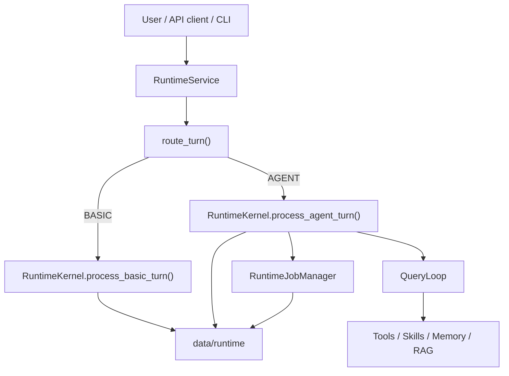

# Architecture

This repository now runs through `src/agentic_chatbot_next/`.

## Live runtime stance

The live system is a session-oriented runtime with two top-level routes:

- `BASIC`: direct chat with no tools
- `AGENT`: late-bound agent execution with tools, worker jobs, notifications, and persistence

It is not a monolithic graph runtime. LangGraph is used tactically inside the `react`
executor, while the top-level orchestration is plain Python code in the next runtime.

## Main components

### Entrypoints

- CLI: `src/agentic_chatbot_next/cli.py`
- FastAPI gateway: `src/agentic_chatbot_next/api/main.py`

Both entrypoints build `RuntimeService` from `src/agentic_chatbot_next/app/service.py`.

### Runtime service

`RuntimeService` owns:

- eager session-workspace open when `WORKSPACE_DIR` is configured
- upload ingest and upload-summary kickoff
- route selection
- choosing the initial agent
- handoff into the session kernel

### Router

`src/agentic_chatbot_next/router/` decides `BASIC` vs `AGENT`.

- deterministic rules live in `router.py`
- the hybrid judge-model path lives in `llm_router.py`
- `policy.py` turns `suggested_agent` hints into the initial live agent selection

### Session kernel

`RuntimeKernel` in `src/agentic_chatbot_next/runtime/kernel.py` owns:

- session-state hydration
- early transcript persistence
- event emission
- notification drain
- tool-context creation
- worker jobs and mailbox continuation
- coordinator planning and worker batching

### Query loop

`QueryLoop` in `src/agentic_chatbot_next/runtime/query_loop.py` is the mode dispatcher
for non-coordinator agents.

It handles:

- skill-context resolution for agents with `skill_scope`
- prompt assembly for prompt-backed modes in the order: base agent prompt,
  optional task/worker context, skill context, memory context
- dispatch to the react executor in `src/agentic_chatbot_next/general_agent.py`
- planner / finalizer / verifier execution
- direct RAG worker execution via `run_rag_contract(...)`
- direct memory-maintainer execution via heuristic extraction

For `react` agents, the actual tool-using turn loop is not implemented entirely inside
`QueryLoop`. `QueryLoop` prepares the run and then delegates to `general_agent.py`, which
uses LangGraph ReAct when native tool binding is available and a plan-execute fallback
otherwise.

Two live exceptions matter:

- the `rag` mode does not build or use a system prompt; it passes recent conversation
  context and uploaded doc ids into `run_rag_contract(...)`
- the `memory_maintainer` mode does not run a model or ReAct loop; it directly extracts
  structured key/value entries from recent messages or the delegated prompt

### Agent registry

`AgentRegistry` loads agent definitions from `data/agents/*.md`.

Markdown frontmatter is now the live source of truth for:

- agent mode
- prompt file
- allowed tools
- allowed worker agents
- memory scopes
- max steps and tool-call limits
- role metadata

### Tools and skills

- tools live under `src/agentic_chatbot_next/tools/`
- skill loading and indexing live under `src/agentic_chatbot_next/skills/`

The current split is:

- tools change or inspect the outside world
- skills inject bounded operating guidance into prompts

The live extension surface is currently internal to the repository:

- Python-defined tool registries
- markdown-defined agents
- retrieved skill-pack context

Broader plugin or MCP-driven extension loading is not part of the live next-runtime contract
today.

The repo also contains helper tool factories under `src/agentic_chatbot_next/rag/`,
but the live `rag_worker` and `rag_agent_tool` paths do not currently assemble those
toolkits.

### RAG

The live RAG flow lives under `src/agentic_chatbot_next/rag/`.

The stable contract is unchanged:

- `answer`
- `citations`
- `used_citation_ids`
- `confidence`
- `retrieval_summary`
- `followups`
- `warnings`

### Memory

The live runtime uses file-backed memory under `data/memory/...`.

Authoritative state is written to `index.json`. Human-readable `MEMORY.md` and
`topics/*.md` are derived outputs.

Post-turn memory maintenance currently uses a heuristic extractor over the latest user turn.
Conversation-scope entries may be written from structured key/value text, while user-scope
entries require explicit memory intent such as "remember" or "save".

The delegated `memory_maintainer` role still exists for explicit worker use, but the normal
post-turn memory path is kernel-owned heuristic extraction rather than an automatic delegated
agent run.

### Persistence

The next runtime persists:

- session state
- transcripts
- events
- notifications
- jobs
- mailbox messages
- worker artifacts

under `data/runtime/...`, keyed through `filesystem_key(...)`.

## High-level flow

