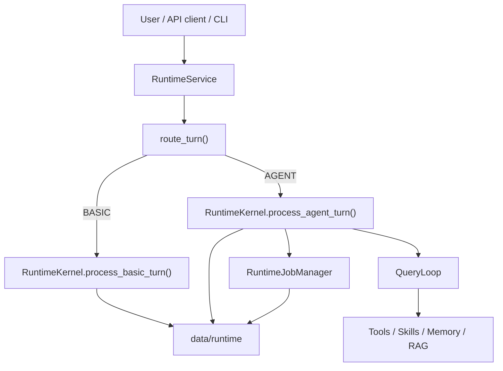

# Architecture

This repository now runs through `src/agentic_chatbot_next/`.

## Live runtime stance

The live system is a session-oriented runtime with two top-level routes:

- `BASIC`: direct chat with no tools
- `AGENT`: late-bound agent execution with tools, worker jobs, notifications, and persistence

It is not a monolithic graph runtime. LangGraph is used tactically inside the `react`
executor, while the top-level orchestration is plain Python code in the next runtime.

## Main components

### Entrypoints

- CLI: `src/agentic_chatbot/cli.py`
- FastAPI gateway: `src/agentic_chatbot/api/main.py`

Both entrypoints build `RuntimeService` from `src/agentic_chatbot_next/app/service.py`.

### Runtime service

`RuntimeService` owns:

- workspace setup
- upload ingest kickoff
- route selection
- choosing the initial agent
- handoff into the session kernel

### Router

`src/agentic_chatbot_next/router/` decides `BASIC` vs `AGENT`.

- deterministic rules live in `router.py`
- the hybrid judge-model path lives in `llm_router.py`
- `policy.py` turns `suggested_agent` hints into the initial live agent selection

### Session kernel

`RuntimeKernel` in `src/agentic_chatbot_next/runtime/kernel.py` owns:

- session-state hydration
- early transcript persistence
- event emission
- notification drain
- tool-context creation
- worker jobs and mailbox continuation
- coordinator planning and worker batching

### Query loop

`QueryLoop` in `src/agentic_chatbot_next/runtime/query_loop.py` owns per-agent execution.

It handles:

- prompt assembly
- skill-context injection
- memory-context injection
- basic execution
- react execution
- RAG worker execution
- planner / finalizer / verifier execution
- dedicated memory-maintainer execution

### Agent registry

`AgentRegistry` loads agent definitions from `data/agents/*.md`.

Markdown frontmatter is now the live source of truth for:

- agent mode
- prompt file
- allowed tools
- allowed worker agents
- memory scopes
- max steps and tool-call limits
- role metadata

### Tools and skills

- tools live under `src/agentic_chatbot_next/tools/`
- skill loading and indexing live under `src/agentic_chatbot_next/skills/`

The current split is:

- tools change or inspect the outside world
- skills inject bounded operating guidance into prompts

### RAG

The live RAG flow lives under `src/agentic_chatbot_next/rag/`.

The stable contract is unchanged:

- `answer`
- `citations`
- `used_citation_ids`
- `confidence`
- `retrieval_summary`
- `followups`
- `warnings`

### Memory

The live runtime uses file-backed memory under `data/memory/...`.

Authoritative state is written to `index.json`. Human-readable `MEMORY.md` and
`topics/*.md` are derived outputs.

### Persistence

The next runtime persists:

- session state
- transcripts
- events
- notifications
- jobs
- mailbox messages
- worker artifacts

under `data/runtime/...`, keyed through `filesystem_key(...)`.

## High-level flow

## Legacy status

`src/agentic_chatbot/runtime/*` is no longer the live execution path. It remains in the
repository as migration/reference code only.
