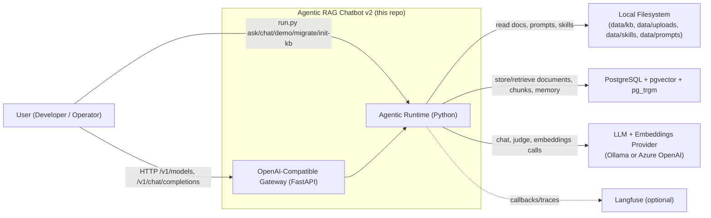
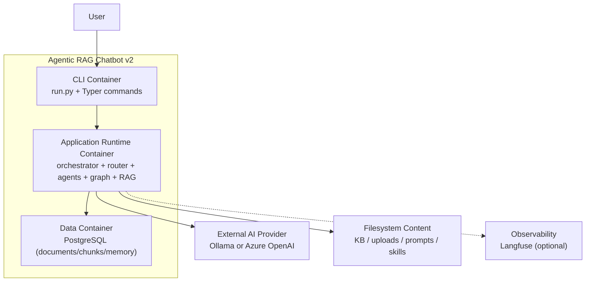

# C4 Architecture (Code-Accurate)

This document provides C4 views of the current implementation in this repository.

Verification baseline:
- `src/agentic_chatbot/cli.py`
- `src/agentic_chatbot/agents/orchestrator.py`
- `src/agentic_chatbot/graph/*`
- `src/agentic_chatbot/rag/*`
- `src/agentic_chatbot/db/*`
- `src/agentic_chatbot/observability/callbacks.py`
- `docker-compose.yml`

## Scope and assumptions

- Runtime interfaces are:
  - CLI (`python run.py ...`)
  - FastAPI gateway (`python run.py serve-api`) exposing OpenAI-compatible `/v1` endpoints.
- In simplified mode, the gateway does not enforce in-app authentication.
- The AGENT path is supervisor-graph first, with a legacy single-agent fallback only for capability/config issues.
- Langfuse is optional and enabled only when keys are configured.

---

## C4 Level 1: System Context



### Context explanation

- Users operate the system through CLI commands.
- The runtime ingests documents from local paths and persists normalized data to PostgreSQL.
- LLMs and embeddings are provided by either Ollama or Azure OpenAI (configurable).
- Langfuse receives tracing callbacks only when `LANGFUSE_PUBLIC_KEY` and `LANGFUSE_SECRET_KEY` are set.

---

## C4 Level 2: Container View



### Container notes

- `cli` is the operational entrypoint (`ask`, `chat`, `demo`, `migrate`, `init-kb`, `reset-indexes`).
- `runtime` is a single Python process centered on `ChatbotApp`.
- `pg` stores all persistent state for retrieval and memory.
- In Docker Compose, this maps to:
  - `app`
  - `rag-postgres`
  - optional `ollama` profile
  - optional `observability` profile (Langfuse stack)

---

## C4 Level 3: Component View (Application Runtime Container)

```mermaid
flowchart LR
    cli["CLI Adapter\nrun.py + Typer commands"]
    api["API Adapter\nFastAPI /v1 endpoints"]
    settings["Settings Loader\nload_settings()"]
    ctx["Context Resolver\nbuild_local_context()"]

    preflight["Provider Dependency Preflight\nvalidate_provider_dependencies()"]
    providers["Provider Factory\nbuild_providers()"]
    llm["External AI Provider\nOllama or Azure OpenAI"]

    orch["Orchestrator\nChatbotApp.process_turn()"]
    router["Deterministic Router\nroute_message()"]
    basic["Basic Chat Agent\nrun_basic_chat()"]
    graph["Supervisor Graph Executor\nbuild_multi_agent_graph()"]
    fallback["Legacy Fallback\nrun_general_agent()"]
    fallbackTools["Fallback Toolset\ncalculator/list_docs/memory_*/rag_agent_tool"]

    sup["Supervisor Node\n(dynamic via AgentRegistry)"]
    ragNode["RAG Node"]
    utilNode["Utility Node"]
    dataNode["Data Analyst Node\n(pandas + Docker sandbox)"]
    planner["Parallel Planner\n(enriched delegation specs)"]
    worker["RAG Worker(s)"]
    synth["RAG Synthesizer"]
    evaluator["Evaluator Node\n(Generator-Evaluator, max 1 retry)"]
    clarify["Clarification Node\n(turn-ending, routes to END)"]

    ragCore["RAG Core\nrun_rag_agent()"]
    ragTools["RAG Toolset\nresolve/search/extract/compare/scratchpad\n+extended(5)+graph_search(opt-in)"]
    ingest["Ingestion Pipeline\ningest_paths() + OCR/structure split\n+contextual retrieval(opt-in)"]
    graphrag["GraphRAG\n(opt-in: entity/community indexing + search)"]
    stores["Store Layer\nDocumentStore / ChunkStore / MemoryStore"]
    db["PostgreSQL\n(pgvector + pg_trgm)"]
    fs["Filesystem Sources\ndata/kb, uploads, prompts, skills"]

    callbacks["Langfuse Callback Adapter\nget_langchain_callbacks()"]
    langfuse["Langfuse (optional)"]

    cli --> settings
    api --> settings
    settings --> preflight
    preflight --> providers

    cli --> ctx
    api --> ctx
    ctx --> orch
    cli --> orch
    api --> orch

    orch --> router
    orch --> callbacks
    orch --> ingest
    orch -->|"upload summary kickoff"| ragCore

    router -->|"BASIC"| basic
    router -->|"AGENT"| graph

    graph --> sup
    sup -->|"rag_agent"| ragNode
    sup -->|"utility_agent"| utilNode
    sup -->|"data_analyst"| dataNode
    sup -->|"parallel_rag"| planner
    sup -->|"clarify"| clarify
    planner --> worker
    worker --> synth
    synth --> evaluator
    ragNode --> evaluator
    utilNode --> evaluator
    evaluator -->|"pass/retry"| sup
    dataNode --> sup

    graph -->|"capability/config error only"| fallback
    fallback --> fallbackTools
    fallbackTools --> stores
    fallbackTools -.->|"via rag_agent_tool"| ragCore

    ragNode --> ragCore
    worker --> ragCore
    ragCore --> ragTools
    ragTools --> stores
    ragTools -.->|"graph_search (opt-in)"| graphrag
    ingest --> stores
    ingest -.->|"graphrag index (opt-in)"| graphrag
    stores --> db
    ingest --> fs
    ragCore --> fs

    providers --> basic
    providers --> graph
    providers --> fallback
    providers --> ragCore
    providers --> llm

    callbacks -.-> basic
    callbacks -.-> graph
    callbacks -.-> ragCore
    callbacks -.-> fallback
    callbacks -.-> langfuse
```

### Component responsibilities

| Component | Responsibility | Code |
|---|---|---|
| CLI Adapter | Command entrypoint (`ask/chat/demo/migrate/init-kb/doctor`) | `run.py`, `src/agentic_chatbot/cli.py` |
| API Adapter | OpenAI-compatible HTTP interface (`/v1/models`, `/v1/chat/completions`, `/v1/ingest/documents`) | `src/agentic_chatbot/api/main.py` |
| Settings + Context Resolver | Load env config and derive default/local request context | `src/agentic_chatbot/config.py`, `src/agentic_chatbot/context.py` |
| Provider Dependency Preflight | Verify required provider packages before runtime/provider construction | `src/agentic_chatbot/providers/dependency_checks.py` |
| Provider Factory | Build chat, judge, and embedding providers | `src/agentic_chatbot/providers/llm_factory.py` |
| Orchestrator | Turn lifecycle, routing, upload kickoff, callback propagation | `src/agentic_chatbot/agents/orchestrator.py` |
| Router | Deterministic `BASIC` vs `AGENT` decision | `src/agentic_chatbot/router/router.py` |
| Basic Chat Agent | Direct LLM response without tools | `src/agentic_chatbot/agents/basic_chat.py` |
| Supervisor Graph Executor | Supervisor-driven specialist orchestration | `src/agentic_chatbot/graph/builder.py`, `src/agentic_chatbot/graph/supervisor.py` |
| Utility Node | Calculator/list-docs/memory tool loop | `src/agentic_chatbot/graph/nodes/utility_node.py` |
| Data Analyst Node | Pandas/Excel/CSV analysis via Docker sandbox; auto-disabled if Docker unavailable | `src/agentic_chatbot/graph/nodes/data_analyst_node.py`, `src/agentic_chatbot/sandbox/docker_executor.py` |
| Agent Registry | Dynamic agent catalog; renders `{{available_agents}}` into supervisor prompt | `src/agentic_chatbot/agents/agent_registry.py` |
| RAG Node + Worker(s) | Single and parallel RAG execution adapters | `src/agentic_chatbot/graph/nodes/rag_node.py`, `src/agentic_chatbot/graph/nodes/rag_worker_node.py` |
| RAG Synthesizer | Merge worker outputs and clear worker state | `src/agentic_chatbot/graph/nodes/rag_synthesizer_node.py`, `src/agentic_chatbot/graph/state.py` |
| Evaluator Node | Generator-Evaluator quality gate; max 1 retry for RAG outputs | `src/agentic_chatbot/graph/nodes/evaluator_node.py` |
| Clarification Node | Emits clarification question and ends turn | `src/agentic_chatbot/graph/nodes/clarification_node.py` |
| Legacy Fallback | Single-agent ReAct path for capability/config fallback | `src/agentic_chatbot/agents/general_agent.py` |
| RAG Core | Tool-calling RAG loop + synthesis contract | `src/agentic_chatbot/rag/agent.py` |
| RAG Tools | Retrieval, extraction, comparison, scratchpad (+ extended + graph search) | `src/agentic_chatbot/tools/rag_tools.py`, `src/agentic_chatbot/tools/rag_tools_extended.py` |
| Ingestion Pipeline | File loading, OCR/Docling, structure-aware chunking, contextual retrieval (opt-in) | `src/agentic_chatbot/rag/ingest.py`, `src/agentic_chatbot/rag/ocr.py` |
| GraphRAG (opt-in) | Microsoft GraphRAG entity/community indexing and search | `src/agentic_chatbot/graphrag/` |
| Store Layer | PostgreSQL-backed document/chunk/memory IO | `src/agentic_chatbot/db/document_store.py`, `src/agentic_chatbot/db/chunk_store.py`, `src/agentic_chatbot/db/memory_store.py` |
| Callback Adapter | LangChain/LangGraph callback construction | `src/agentic_chatbot/observability/callbacks.py` |

Provider dependency preflight now gates runtime initialization in both CLI and API startup paths. If required packages are missing, runtime construction fails fast with explicit remediation instructions.

---

## RAG invocation modes (important architectural detail)

`run_rag_agent()` is used in four modes:

1. Primary AGENT path via supervisor handoff to `rag_agent` node.
2. Parallel AGENT path via `rag_worker` nodes after `parallel_planner`.
3. Upload kickoff path directly from orchestrator after ingestion.
4. Legacy fallback path through `rag_agent_tool` used by `GeneralAgent`.

So in current architecture, RAG is primarily orchestrated through agent handoffs in the supervisor graph, and secondarily used as a tool in the legacy fallback path.

---

## Accuracy checklist

- Matches current routing behavior: `BASIC` or `AGENT` via deterministic router (+ optional LLM hybrid router).
- Matches fallback behavior: only capability/config failures fall back to legacy agent.
- Matches graph topology: supervisor, utility, data_analyst, rag node, parallel planner, rag workers, synthesizer, **evaluator**, **clarify** (9 nodes).
- Matches dynamic agent discovery: `AgentRegistry` drives supervisor prompt and valid-response validation.
- Matches persistence: single PostgreSQL backend for documents/chunks/memory.
- Matches observability: callback-driven Langfuse integration (optional).
- `data_analyst` node auto-disabled when Docker daemon is unreachable.
- GraphRAG integration is opt-in (`GRAPHRAG_ENABLED=true`); system runs without it.
- Contextual retrieval is opt-in (`CONTEXTUAL_RETRIEVAL_ENABLED=true`); uses `build_providers(settings).judge_llm`.
- Evaluator grades RAG/parallel_rag outputs; passes utility and data_analyst outputs through unconditionally.
