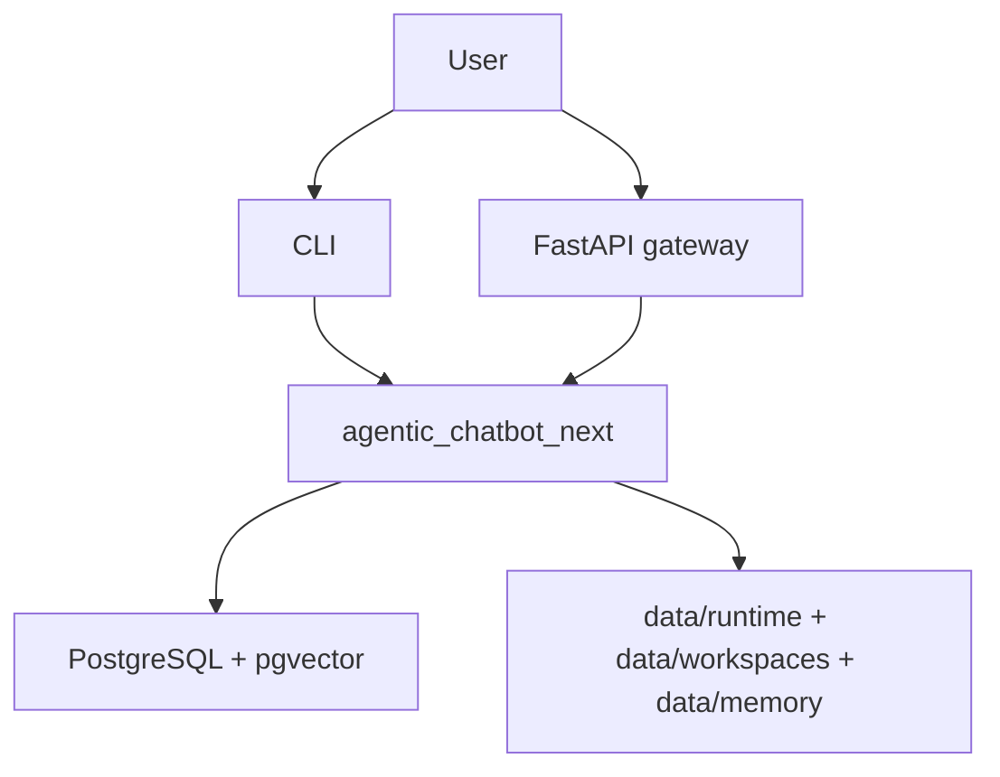
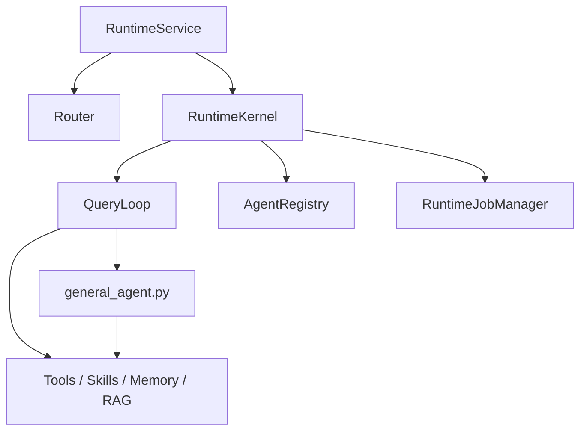

# C4 Architecture

## System context

## Container view

## Component notes

- `RuntimeService` is the live service boundary
- `RuntimeKernel` is the persisted session kernel that owns session state, jobs, and notifications
- `QueryLoop` dispatches by agent mode; prompt-backed modes get prompt, memory, and skill
  context, while `rag` and `memory_maintainer` use direct execution paths
- `general_agent.py` is the live react executor for tool-using `react` agents
- `AgentRegistry` loads markdown-defined roles from `data/agents/*.md`
- `RuntimeJobManager` owns durable workers and mailboxes
