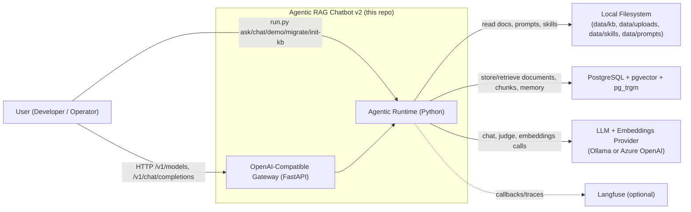
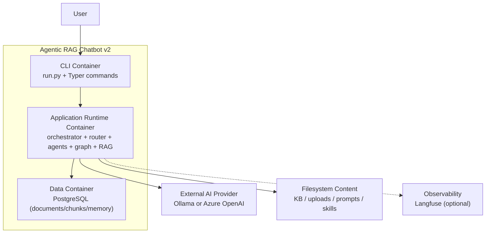

# C4 Architecture (Code-Accurate)

This document provides C4 views of the current implementation in this repository.

Verification baseline:
- `src/agentic_chatbot/cli.py`
- `src/agentic_chatbot/agents/orchestrator.py`
- `src/agentic_chatbot/graph/*`
- `src/agentic_chatbot/rag/*`
- `src/agentic_chatbot/db/*`
- `src/agentic_chatbot/observability/callbacks.py`
- `docker-compose.yml`

## Scope and assumptions

- Runtime interfaces are:
  - CLI (`python run.py ...`)
  - FastAPI gateway (`python run.py serve-api`) exposing OpenAI-compatible `/v1` endpoints.
- The AGENT path is supervisor-graph first, with a legacy single-agent fallback only for capability/config issues.
- Langfuse is optional and enabled only when keys are configured.

---

## C4 Level 1: System Context



### Context explanation

- Users operate the system through CLI commands.
- The runtime ingests documents from local paths and persists normalized data to PostgreSQL.
- LLMs and embeddings are provided by either Ollama or Azure OpenAI (configurable).
- Langfuse receives tracing callbacks only when `LANGFUSE_PUBLIC_KEY` and `LANGFUSE_SECRET_KEY` are set.

---

## C4 Level 2: Container View



### Container notes

- `cli` is the operational entrypoint (`ask`, `chat`, `demo`, `migrate`, `init-kb`, `reset-indexes`).
- `runtime` is a single Python process centered on `ChatbotApp`.
- `pg` stores all persistent state for retrieval and memory.
- In Docker Compose, this maps to:
  - `app`
  - `rag-postgres`
  - optional `ollama` profile
  - optional `observability` profile (Langfuse stack)

---

## C4 Level 3: Component View (Application Runtime Container)

```mermaid
flowchart LR
    cli["CLI Layer\n(agentic_chatbot.cli)"]
    orch["Orchestrator\nChatbotApp.process_turn"]
    router["Deterministic Router\nroute_message()"]

    basic["Basic Chat Agent\nrun_basic_chat()"]
    graph["Multi-Agent Graph Invoker\nbuild_multi_agent_graph()"]
    fallback["Legacy Fallback\nrun_general_agent()"]
    genTools["General Toolset\ncalculator, list_docs, memory_*, rag_agent_tool"]

    sup["Supervisor Node"]
    ragNode["RAG Node"]
    utilNode["Utility Node"]
    planner["Parallel Planner"]
    worker["RAG Worker(s)"]
    synth["RAG Synthesizer"]

    ragCore["RAG Core\nrun_rag_agent()"]
    ragTools["RAG Toolset\nsearch/extract/compare/scratchpad"]
    ingest["Ingestion Pipeline\ningest_paths()"]
    stores["Store Layer\nDocumentStore / ChunkStore / MemoryStore"]
    db["PostgreSQL"]

    providers["Provider Factory\nchat/judge/embeddings"]
    cb["Langfuse Callback Adapter\nget_langchain_callbacks()"]
    obs["Langfuse"]

    cli --> orch
    cli --> providers

    orch --> router
    orch --> cb

    router -->|"BASIC"| basic
    router -->|"AGENT"| graph

    graph --> sup
    sup -->|"rag_agent"| ragNode
    sup -->|"utility_agent"| utilNode
    sup -->|"parallel_rag"| planner
    planner --> worker
    worker --> synth
    synth --> sup

    graph -->|"capability/config error only"| fallback
    fallback --> genTools
    genTools --> stores
    genTools -.->|"via rag_agent_tool"| ragCore

    ragNode --> ragCore
    worker --> ragCore
    orch --> ingest
    orch -->|"upload summary kickoff"| ragCore

    ragCore --> ragTools
    ragTools --> stores
    ingest --> stores
    stores --> db

    providers --> ragCore
    providers --> basic
    providers --> graph
    providers --> fallback

    cb -.-> basic
    cb -.-> graph
    cb -.-> ragCore
    cb -.-> fallback
    cb -.-> obs
```

### Component responsibilities

| Component | Responsibility | Code |
|---|---|---|
| CLI Layer | Command entrypoint (`ask/chat/demo/...`) | `run.py`, `src/agentic_chatbot/cli.py` |
| Orchestrator | Turn lifecycle, routing, upload kickoff, callback propagation | `src/agentic_chatbot/agents/orchestrator.py` |
| Router | Deterministic `BASIC` vs `AGENT` decision | `src/agentic_chatbot/router/router.py` |
| Basic Chat Agent | Direct LLM response without tools | `src/agentic_chatbot/agents/basic_chat.py` |
| Multi-Agent Graph | Supervisor-driven specialist orchestration | `src/agentic_chatbot/graph/builder.py`, `src/agentic_chatbot/graph/supervisor.py` |
| Utility Node | Calculator/list-docs/memory tool loop | `src/agentic_chatbot/graph/nodes/utility_node.py` |
| RAG Node + Worker(s) | Single and parallel RAG execution adapters | `src/agentic_chatbot/graph/nodes/rag_node.py`, `src/agentic_chatbot/graph/nodes/rag_worker_node.py` |
| RAG Synthesizer | Merge worker outputs and clear worker state | `src/agentic_chatbot/graph/nodes/rag_synthesizer_node.py`, `src/agentic_chatbot/graph/state.py` |
| Legacy Fallback | Single-agent ReAct path for capability/config fallback | `src/agentic_chatbot/agents/general_agent.py` |
| RAG Core | Tool-calling RAG loop + synthesis contract | `src/agentic_chatbot/rag/agent.py` |
| RAG Tools | Retrieval, extraction, comparison, scratchpad operations | `src/agentic_chatbot/tools/rag_tools.py` |
| Ingestion Pipeline | File loading, OCR fallback, structure-aware chunking | `src/agentic_chatbot/rag/ingest.py`, `src/agentic_chatbot/rag/ocr.py` |
| Store Layer | PostgreSQL-backed document/chunk/memory IO | `src/agentic_chatbot/db/document_store.py`, `src/agentic_chatbot/db/chunk_store.py`, `src/agentic_chatbot/db/memory_store.py` |
| Provider Factory | Builds chat, judge, embeddings providers | `src/agentic_chatbot/providers/llm_factory.py` |
| Callback Adapter | LangChain/LangGraph callback construction | `src/agentic_chatbot/observability/callbacks.py` |

---

## RAG invocation modes (important architectural detail)

`run_rag_agent()` is used in four modes:

1. Primary AGENT path via supervisor handoff to `rag_agent` node.
2. Parallel AGENT path via `rag_worker` nodes after `parallel_planner`.
3. Upload kickoff path directly from orchestrator after ingestion.
4. Legacy fallback path through `rag_agent_tool` used by `GeneralAgent`.

So in current architecture, RAG is primarily orchestrated through agent handoffs in the supervisor graph, and secondarily used as a tool in the legacy fallback path.

---

## Accuracy checklist

- Matches current routing behavior: `BASIC` or `AGENT` via deterministic router.
- Matches fallback behavior: only capability/config failures fall back to legacy agent.
- Matches graph topology: supervisor, utility, rag node, parallel planner, rag workers, synthesizer.
- Matches persistence: single PostgreSQL backend for documents/chunks/memory.
- Matches observability: callback-driven Langfuse integration (optional).
