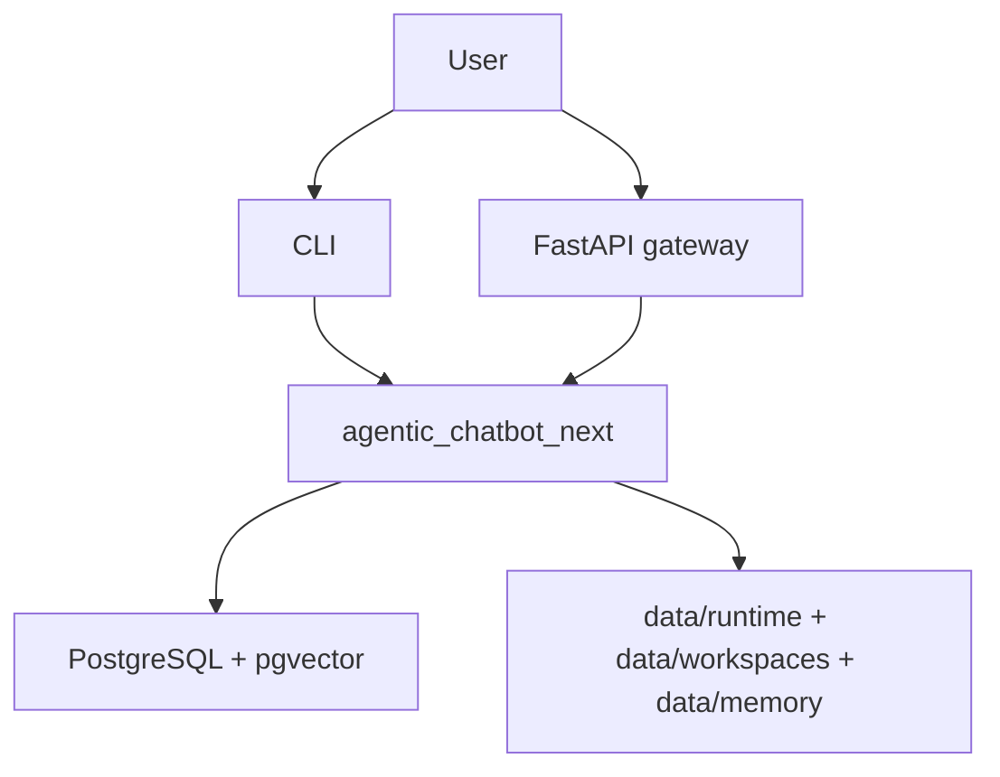
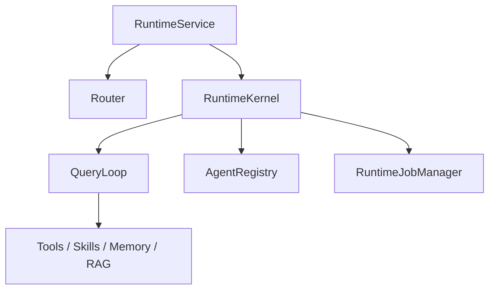

# C4 Architecture

## System context

## Container view

## Component notes

- `RuntimeService` is the live service boundary
- `RuntimeKernel` is the persisted session kernel
- `QueryLoop` is the per-agent execution engine
- `AgentRegistry` loads markdown-defined roles from `data/agents/*.md`
- `RuntimeJobManager` owns durable workers and mailboxes
