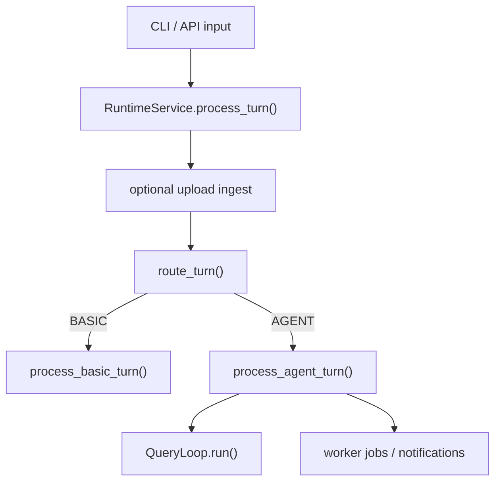

# Control Flow

This document describes the current live turn flow through `agentic_chatbot_next`.

## End-to-end path

## 1. Transport layer

The FastAPI gateway and CLI normalize user input, conversation scope, and uploads, then call
`RuntimeService`.

## 2. Service layer

`RuntimeService.process_turn(...)`:

1. eagerly opens the canonical session workspace when `WORKSPACE_DIR` is configured
2. ensures the KB is indexed for the tenant
3. when uploads are present, ingests them and appends a RAG-generated upload summary into
   session history
4. calls the router
5. emits a router-decision event
6. hands off to `RuntimeKernel.process_basic_turn(...)` or
   `RuntimeKernel.process_agent_turn(...)`

## 3. BASIC route

`RuntimeKernel.process_basic_turn(...)`:

1. hydrates or creates `SessionState`
2. drains pending notifications
3. appends the user turn
4. persists state and transcript before model execution
5. emits `basic_turn_started`
6. runs the basic chat executor
7. appends the assistant turn
8. persists state and transcript again
9. emits `basic_turn_completed`

## 4. AGENT route

`RuntimeKernel.process_agent_turn(...)`:

1. hydrates or creates `SessionState`
2. drains pending notifications
3. appends the user turn
4. persists state and transcript before execution
5. resolves the initial agent from `data/agents/*.md`
6. builds callbacks and emits `turn_accepted`, `agent_run_started`, and `agent_turn_started`
7. delegates to `run_agent(...)`

## 5. Non-coordinator agent execution

`RuntimeKernel.run_agent(...)`:

1. builds `ToolContext`
2. resolves the allowed tool set for the selected agent
3. calls `QueryLoop.run(...)`
4. writes the returned messages back into session state
5. emits completion/failure events

## 6. Coordinator execution

For `coordinator`, the kernel runs:

1. planner
2. worker batching
3. finalizer
4. verifier
5. optional revision pass if verification requests it

Workers run as durable jobs with mailbox continuation and notification reinjection.

## 7. Query loop execution modes

`QueryLoop.run(...)` resolves skill context for agents that declare `skill_scope`, then
dispatches by mode:

- `react`, `planner`, `finalizer`, and `verifier` build prompts from base prompt,
  optional task/worker context, skill context, and bounded file-memory context
- `rag` calls `run_rag_contract(...)` directly with recent conversation context and
  uploaded doc ids
- `memory_maintainer` skips prompt/model execution and runs direct heuristic extraction

The class still contains a `basic` handler for parity, but the normal BASIC service path
goes straight through `RuntimeKernel.process_basic_turn(...)` rather than through
`QueryLoop.run(...)`.

For `react` agents, `QueryLoop` then delegates to
`src/agentic_chatbot_next/general_agent.py`.

That executor:

- uses LangGraph `create_react_agent(...)` when the model supports tool binding
- falls back to a plan-execute loop when tool binding is unavailable or forced
- keeps `data_analyst` on the guided `plan_execute` path when the agent metadata requests it
- owns recovery from native tool-loop failure, missing final answers, and truncated outputs

## 8. Persistence timing

The live runtime persists accepted user turns before execution begins.

That means resume/debugging artifacts survive:

- model failures
- tool failures
- worker failures

## 9. Observability

Local runtime events are the source of truth.

Current event families include:

- router decisions
- turn acceptance / completion / failure
- basic-turn lifecycle
- agent-run lifecycle
- agent-turn lifecycle
- model lifecycle
- tool lifecycle
- coordinator planning/batch/finalizer/verifier events
- worker-job lifecycle, mailbox, and notification append events
- notification append events
- memory extraction events

The post-turn memory path is heuristic today, not a dedicated maintenance-agent loop. It writes
conversation memory from structured entries in the latest user turn and only writes user memory
when the turn contains explicit memory intent.

Worker failures currently surface as `job_failed`; there is no separate
`worker_agent_failed` runtime event in the live implementation.
